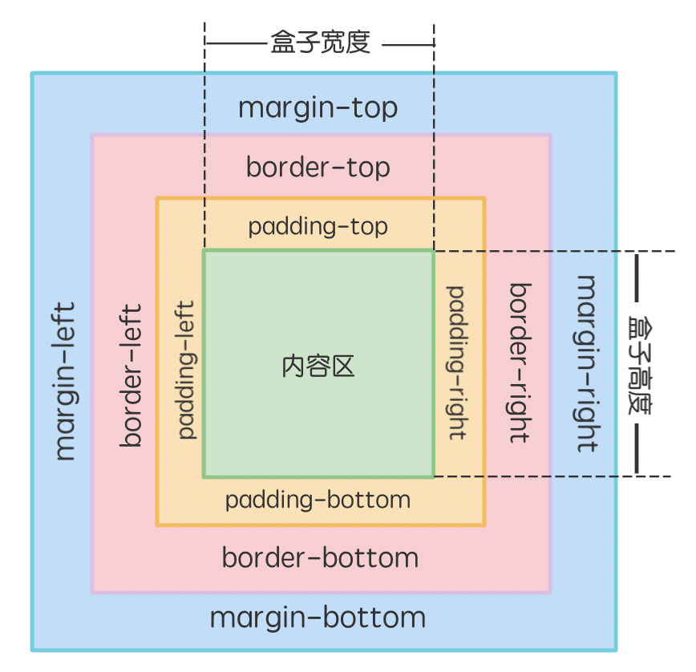

盒子模型

盒子模型=外边距+边框+内边距+宽 / 高。

宽高：用来控制元素显示大小。
边框（border）：控制元素的边框效果。
外边距（margin）：控制元素显示位置。
内边距（padding）：控制元素内容的位置。

1.margin外边距

元素水平居中 margin:0 auto;（注意这是让元素自身居中；

text-align:center; 是让元素里面的文本在元素内部居中）；

上右下左赋值 margin:10px 20px 30px 40px;（顺时针）。

2.border边框
border：粗细 样式 颜色

圆角 border-radius: 10px;，值越大越圆，超过宽高的一半时会变为圆形（前提是正方形）。

3.padding 内边距
上右下左
