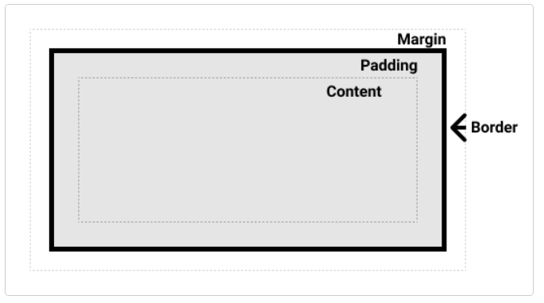

# CSS布局

## 盒模型

通过对盒子`display`属性的设置，例如`block`、`inline`来控制盒子的外部显示类型

### 内部和外部显示类型

box模型有一个外部显示类型，来决定盒子是块级还是内联。
盒子的内部显示类型，决定了盒子内部元素是如何布局，正常情况下是按照**正常文档流**布局。但是可以通过`display：flex`来更改内部显示类型，该盒子所有直接子元素都会成为flex元素。

### 块级盒子（block box）

一个被定义成块级的盒子会表现出以下行为

- 盒子会在内联的方向上扩展并占据父容器在该方向上的所有可用空间，在绝大数情况下意味着盒子会和父容器一样宽
- 每个盒子都会换行
- width 和 height 属性可以发挥作用
- 内边距（padding）, 外边距（margin）和 边框（border）会将其他元素从当前盒子周围“推开”

### 内联盒子（inline box）

一个被定义成内联盒子会出现以下行为：

- 盒子不会产生换行。
- width 和 height 属性将不起作用。
- 垂直方向的内边距、外边距以及边框会被应用但是不会把其他处于 inline 状态的盒子推开。
- 水平方向的内边距、外边距以及边框会被应用且会把其他处于 inline 状态的盒子推开。
用做链接的` <a> `元素、 `<span>`、 `<em>` 以及 `<strong>` 都是默认处于 inline 状态的

### 定义

CSS 盒模型应用于块级盒子，内联盒子只使用盒模型中定义的部分内容。模型定义了盒的每个部分——margin、border、padding 和 content——合在一起就可以创建我们在页面上看到的内容。
组成部分：

- Content box: 这个区域是用来显示内容，大小可以通过设置 width 和 height.
- Padding box: 包围在内容区域外部的空白区域；大小通过 padding 相关属性设置。
- Border box: 边框盒包裹内容和内边距。大小通过 border 相关属性设置。
- Margin box: 这是最外面的区域，是盒子和其他元素之间的空白区域。大小通过 margin 相关属性设置。


```css
.box {
  width: 350px;
  height: 150px;
  margin: 25px;
  padding: 25px;
  border: 5px solid black;
}
```

使用标准模型，实际占用空间的宽高分别为：宽度 = 410px (350 + 25 + 25 + 5 + 5)，高度 = 210px (150 + 25 + 25 + 5 + 5)。

1. 在标准模型中，如果你给盒设置 width 和 height，实际设置的是 content box。padding 和 border 再加上设置的宽高一起决定整个盒子的大小。
2. 通过为其设置 `box-sizing: border-box` 来实现。这样就可以告诉浏览器使用 `border-box` 来定义区域，从而设定宽度是可见宽度。(这叫做替代盒模型)

### 组成

一、外边距：

1. 外边距是盒子周围一圈看不到的空间。它会把其他元素从盒子旁边推开。外边距属性值可以为正也可以为负。设置负值会导致和其他内容重叠。
2. 可以使用margin属性一次控制一个元素的所有边距
   - `margin-top margin-right margin-bottom margin-left`
3. 外边距折叠：如果你有两个外边距相接的元素，这些外边距将合并为一个外边距，即最大的单个外边距的大小。

二、边框：

1. 边框是在边距和填充框之间绘制的。如果你正在使用标准的盒模型，边框的大小将添加到框的宽度和高度。如果你使用的是替代盒模型，那么边框的大小会使内容框更小，因为它会占用一些可用的宽度和高度。
2. 设置边框的宽度、颜色和样式，可以使用：`border-top border-right border-bottom border-left`
3. 设置所有边框的颜色、样式或宽度，可以使用:`border-width border-style border-color`

三、内边距

1. 内边距位于边框和内容区域之间。与外边距不同，你不能有负数量的内边距，所以值必须是 0 或正的值。应用于元素的任何背景都将显示在内边距后面，内边距通常用于将内容推离边框。
2. 可以使用`padding`简写属性控制元素所有边，或者每边单独使用等价的普通属性：`padding-top padding-right padding-bottom padding-left`

## 内联盒子

使用display：inline-block
display 有一个特殊的值，它在内联和块之间提供了一个中间状态。这对于以下情况非常有用：不希望一个项切换到新行，但希望它可以设定宽度和高度，并避免上面看到的重叠。

- 设置width 和height 属性会生效。
- padding, margin, 以及border 会推开其他元素。

它不会跳转到新行，如果显式添加 width 和 height 属性，它只会变得比其内容更大。

- vertical-align 属性会影响到 inline-block 元素，你可能会把它的值设置为 top 。
- 你需要设置每一列的宽度
- 如果HTML源代码中元素之间有空格，那么列与列之间会产生空隙

## 重要属性

### display

每个元素都有一个默认的display值，且大多数元素的默认值为`block`或`inline`。
`inline`被叫做行内元素；

1. `block`通常被叫做块级元素；该元素之前和之后会产生换行
`div` 是一个标准的块级元素。一个块级元素会新开始一行并且尽可能撑满容器。其他常用的块级元素包括 `p`、 `form` 和HTML5中的新元素： `header` 、 `footer` 、 `section` 。

2. `inline`被叫做行内元素；该元素之前或之后的不会产生换行
`span` 是一个标准的行内元素。一个行内元素可以在段落中 <span> 像这样 </span> 包裹一些文字而不会打乱段落的布局。 a 元素是最常用的行内元素，它可以被用作链接。

3. `none`通常用在不删除元素情况下隐藏或显示元素。


