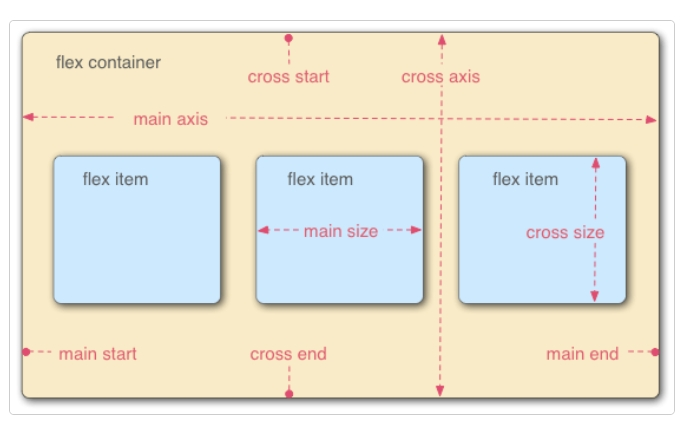

# 弹性盒子

默认文档流中，在一个父容器里放置多个块级的子元素，那么，这些子元素会默认从上往下排列。

在此基础之上，如果我给父容器仅仅加一个 `display: flex`属性，此时，这些子元素们会**在水平方向上，从左至右排列**。

## flex 布局的优势

1、**flex 布局的子元素不会脱离文档流**，很好地遵从了“流的特性”。

但你如果用 float 来做布局，float 属性的元素会脱离文档流，而且会涉及到各种 BFC、清除浮动的问题。浮动相关的问题，比较麻烦，所以也成了面试必问的经典题目。但有了 flex 布局之后，这些问题都不存在的。

2、**flex 是一种现代的布局方式，是 W3C 第一次提供真正用于布局的 CSS 规范**。 flex 非常提供了丰富的属性，非常灵活，让布局的实现更佳多样化，且方便易用。

flex 唯一的缺点就在于，它不支持低版本的 IE 浏览器（flex 布局不支持 IE9 及以下的版本；IE10及以上也只是部分支持）

## 主轴和交叉轴

当元素变现为flex框时，沿着两个轴来布局：


- 主轴（main axis）是沿着 flex 元素放置的方向延伸的轴（比如页面上的横向的行、纵向的列）。该轴的开始和结束被称为 main start 和 main end。flex容器的主轴，默认是水平方向，从左向右。
- 交叉轴（cross axis）是垂直于 flex 元素放置方向的轴。该轴的开始和结束被称为 cross start 和 cross end。默认是垂直方向，从上往下。
- 设置了 display: flex 的父元素被称之为 flex 容器（flex container）。
- 在 flex 容器中表现为弹性的盒子的元素被称之为 flex 项（flex item）.

## 声明

使用 `display:flex` 或 `display:inline-flex` 声明一个**父容器**为弹性盒子。此时，这个父容器里的子元素们，会遵循弹性布局。

备注：一般是用 `display:flex`这个属性。`display:inline-flex`用得较少。

## 属性

### flex-direction

指定了弹性子元素在父容器中的位置
它可以指定主轴的方向（弹性盒子子类放置的地方）——它默认值是 row，这使得它们在按你浏览器的默认语言方向排成一排（在英语/中文浏览器中是从左到右）。

- row：横向从左到右排列（左对齐），默认的排列方式。
- row-reverse：反转横向排列（右对齐，从后往前排，最后一项排在最前面
- column：纵向排列。
- column-reverse：反转纵向排列，从后往前排，最后一项排在最上面。

### flex-wrap

控制子元素溢出时的换行处理
用于指定弹性盒子的子元素换行方式。

值：

- nowrap - 默认， 弹性容器为单行。该情况下弹性子项可能会溢出容器。
- wrap - 弹性容器为多行。该情况下弹性子项溢出的部分会被放置到新行，子项内部会发生断行
- wrap-reverse -反转 wrap 排列。

### flex-flow

是flex-direction和flex-wrap的缩写

```css
flex-direction: row;
flex-wrap: wrap;
//替换为
flex-flow: row wrap;
```

### justify-content

- `justify-content: flex-start;` 设置子元素在**主轴上的对齐方式**。属性值可以是：
  - `flex-start` 从主轴的起点对齐（默认值）
  - `flex-end` 从主轴的终点对齐
  - `center` 居中对齐
  - `space-around` 在父盒子里平分
  - `space-between` 两端对齐 平分

### align-content

用于修改 flex-wrap 属性的行为。类似于 align-items, 但它不是设置弹性子元素的对齐，而是设置各个行的对齐。

- stretch - 默认。各行将会伸展以占用剩余的空间。
- flex-start - 各行向弹性盒容器的起始位置堆叠。
- flex-end - 各行向弹性盒容器的结束位置堆叠。
- center -各行向弹性盒容器的中间位置堆叠。
- space-between -各行在弹性盒容器中平均分布。
- space-around - 各行在弹性盒容器中平均分布，两端保留子元素与子元素之间间距大小的一半。

**水平和垂直对齐**
使用弹性盒子的功能让 flex 项沿主轴或交叉轴对齐

```css
div {
  display: flex;
  align-items: center;//控制flex项在交叉轴上的位置
  justify-content: space-around;//
}
```

1. align-items 控制flex项在交叉轴上的位置
   - 默认的值是 stretch，其会使所有 flex 项沿着交叉轴的方向拉伸以填充父容器。如果父容器在交叉轴方向上没有固定宽度（即高度），则所有 flex 项将变得与最长的 flex 项一样长（即高度保持一致）。我们的第一个例子在默认情况下得到相等的高度的列的原因。
   - 也可以设置诸如 flex-start 或 flex-end 这样使 flex 项在交叉轴的开始或结束处对齐所有的值
   - center 值会使这些项保持其原有的高度，但是会在交叉轴居中。这就是那些按钮垂直居中的原因。
2. justify-content 控制 flex 项在主轴上的位置
   - 默认值是 flex-start，这会使所有 flex 项都位于主轴的开始处。
   - 也可以用 flex-end 来让 flex 项到结尾处。
   - center 在 justify-content 里也是可用的，可以让 flex 项在主轴居中
   - 上面用到的值 space-around 是很有用的——它会使所有 flex 项沿着主轴均匀地分布，在任意一端都会留有一点空间。
   - 还有一个值是 space-between，它和 space-around 非常相似，只是它不会在两端留下任何空间。

## 弹性子元素属性

### 排序

order：

- 设置弹性容器内弹性子元素的属性
- 用整数值来定义排列顺序，数值小的排在前面。可以为负值。
- order 值大的 flex 项比 order 值小的在显示顺序中更靠后。
- 相同 order 值的 flex 项按源顺序显示。所以假如你有四个元素，其 order 值分别是 2，1，1 和 0，那么它们的显示顺序就分别是第四，第二，第三，和第一。

### 对齐

设置"margin"值为"auto"值，自动获取弹性容器中剩余的空间。所以设置垂直方向margin值为"auto"，可以使弹性子元素在弹性容器的两上轴方向都完全居中。

### align-self

align-self会覆盖 align-items 的行为
align-self 属性不适用于块类型的盒模型和表格单元。如果任何 flexbox 元素的侧轴方向 margin 值设置为 auto，则会忽略 align-self。

- auto：如果'align-self'的值为'auto'，则其计算值为元素的父元素的'align-items'值，如果其没有父元素，则计算值为'stretch'。
- flex-start：弹性盒子元素的侧轴（纵轴）起始位置的边界紧靠住该行的侧轴起始边界。
- flex-end：弹性盒子元素的侧轴（纵轴）起始位置的边界紧靠住该行的侧轴结束边界。
- center：弹性盒子元素在该行的侧轴（纵轴）上居中放置。（如果该行的尺寸小于弹性盒子元素的尺寸，则会向两个方向溢出相同的长度）。
- baseline：如弹性盒子元素的行内轴与侧轴为同一条，则该值与'flex-start'等效。其它情况下，该值将参与基线对齐。
- stretch：如果指定侧轴大小的属性值为'auto'，则其值会使项目的边距盒的尺寸尽可能接近所在行的尺寸，但同时会遵照'min/max-width/height'属性的限制。

### flex属性

flex 是 flex-grow、flex-shrink 、flex-basis 缩写组合。
属性用于指定弹性子元素如何分配空间。

- auto: 计算值为 1 1 auto
- initial: 计算值为 0 1 auto
- none：计算值为 0 0 auto
- inherit：从父元素继承
- [ flex-grow ]：定义弹性盒子元素的扩展比率。
- [ flex-shrink ]：定义弹性盒子元素的收缩比率。
- [ flex-basis ]：定义弹性盒子元素的默认基准值。

### flex-grow

用于将弹性盒子的可用空间，分配给弹性元素。可以使用整数或小数声明。

### flex-shrink

与 flex-grow 相反 flex-shrink 是在弹性盒子装不下元素时定义的缩小值。
缩小比例 = 不足的空间 / (元素 1 宽度 x 缩小比例) + (元素 2 宽度 x 缩小比例) ...
最终尺寸 = 元素三宽度 - (缩小比例 x  元素 3 的宽度) X 元素宽度

### flex-basis

flex-basis 属性定义了在分配多余空间之前，项目占据的主轴空间（main size）。浏览器根据这个属性，计算主轴是否有多余空间。

可以是长度单位，也可以是百分比。flex-basis的优先级高于width、height属性。

优先级

flex-basis 优先级大于 width、height
