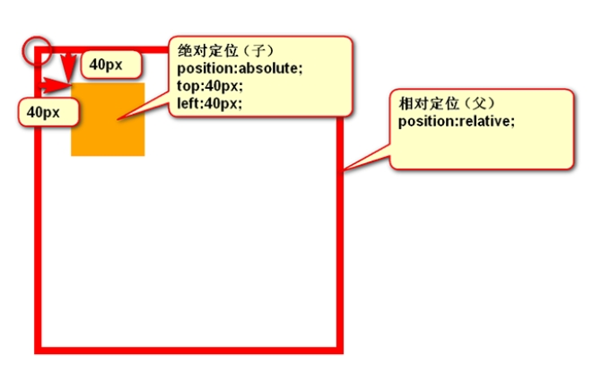

# 定位

## 静态定位

- 静态定位是每个元素获取的默认值——意味着“将元素放入它在文档布局流中的正常位置。
- 静态定位的元素不会受到 top, bottom, left, right影响。
`position：static`

## 相对定位 relative

- left：盒子右移

- right：盒子左移

- top：盒子下移

- bottom：盒子上移
  - 负数表示相反的方向

- 相对定位它与静态定位非常相似，占据在正常的文档流中，除了你仍然可以修改它的最终位置，包括让它与页面上的其他元素重叠。
- **相对定位**：不脱标，老家留坑，**别人不会把它的位置挤走**。
- 相对定位元素经常被用来作为绝对定位元素的容器块。
`position：relative`  
`top, bottom, left, 和 right` 来精确指定要将定位元素移动到的位置。这些属性的值可以采用逻辑上期望的任何单位——px、mm、rem、% 等。
- `top: 30px;`推动框的顶部，使它向下移动 30px。`left:30px`推动框的左边，使它向右移动30px（正值向右偏移，负值向左偏移）;

## 绝对定位 absolute

- 绝对定位的元素的位置相对于最近的已定位父元素，如果元素没有已定位的父元素，那么它的位置相对于`<html>`:
- 绝对定位之后，标签就不区分所谓的行内元素、块级元素了，不需要`display:block`就可以设置宽、高了
- absolute 定位使元素的位置与文档流无关，因此不占据空间。
- absolute 定位的元素和其他元素重叠。
-使用 top，bottom、left 和 right 调整元素大小

### 绝对定位的参考点

（1）如果用**top描述**，那么参考点就是**页面的左上角**，而不是浏览器的左上角

（2）如果用**bottom描述**，那么参考点就是**浏览器首屏窗口尺寸**（好好理解“首屏”二字），对应的页面的左下角

### 以盒子为参考点

一个绝对定位的元素，如果父辈元素中也出现了已定位（无论是绝对定位、相对定位，还是固定定位）的元素，那么将以父辈这个元素，为参考点。

子绝父相
（1） 要听最近的已经定位的祖先元素的，不一定是父亲，可能是爷爷：

```css
<div class="box1">        相对定位
   <div class="box2">    没有定位
    <p></p>           绝对定位，将以box1为参考，因为box2没有定位，box1就是最近的父辈元素
   </div>
</div>

```

再比如：

```css
<div class="box1">        相对定位
   <div class="box2">    相对定位
       <p></p>           绝对定位，将以box2为参考，因为box2是自己最近的父辈元素
    </div>
</div>
```

（2）不一定是相对定位，任何定位，都可以作为子元素的参考点：

“**子绝父相**”有意义：这样可以保证父亲没有脱标，儿子脱标在父亲的范围里面移动。于是，工程上经常这样做：

> 父亲浮动，设置相对定位（零偏移），然后让儿子绝对定位一定的距离。

（3）绝对定位的儿子，无视参考的那个盒子的padding：

下图中，绿色部分是父亲div的padding，蓝色部分p是div的内容区域。此时，如果div相对定位，p绝对定位，那么，
p将无视父亲的padding，在border内侧为参考点，进行定位：

### 让绝对定位中的盒子在父亲里居中

我们知道，如果想让一个**标准流中的盒子在父亲里居中**（水平方向看），可以将其设置`margin: 0 auto`属性。

可如果盒子是绝对定位的，此时已经脱标了，如果还想让其居中（位于父亲的正中间），可以这样做：
left:50%; margin-left:负的宽度的一半

## 固定定位 fixed

- 固定定位固定元素则是相对于浏览器视口，例如固定的导航菜单
- Fixed定位使元素的位置与文档流无关，因此不占据空间。
- Fixed定位的元素和其他元素重叠。

## 粘性定位 sticky

- position: sticky; 基于用户的滚动位置来定位。
- 粘性定位的元素是依赖于用户的滚动，在 position:relative 与 position:fixed 定位之间切换。
- 它的行为就像 position:relative; 而当页面滚动超出目标区域时，它的表现就像 position:fixed;，它会固定在目标位置。
- 元素定位表现为在跨越特定阈值前为相对定位，之后为固定定位。
- 这个特定阈值指的是 top, right, bottom 或 left 之一，换言之，指定 top, right, bottom 或 left 四个阈值其中之一，才可使粘性定位生效。否则其行为与相对定位相同。

## z-index

- z-index属性指定了一个元素的堆叠顺序（哪个元素应该放在前面，或后面），值为整数。
- 网页有一个 z 轴：一条从屏幕表面到你的脸（或者在屏幕前面你喜欢的任何其他东西）的虚线。z-index 值影响定位元素位于该轴上的位置；正值将它们移动到堆栈上方，负值将它们向下移动到堆栈中。默认情况下，定位的元素都具有 z-index 为 auto，实际上为 0。
- 具有更高堆叠顺序的元素总是在较低的堆叠顺序元素的前面。
- 如果两个定位元素重叠，没有指定z - index，最后定位在HTML代码中的元素将被显示在最前面。

