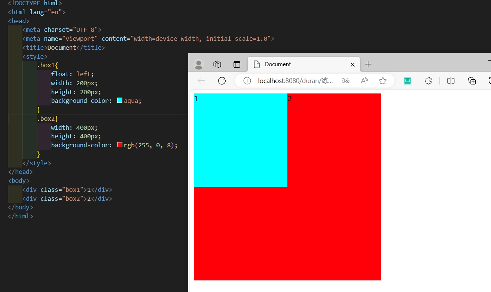
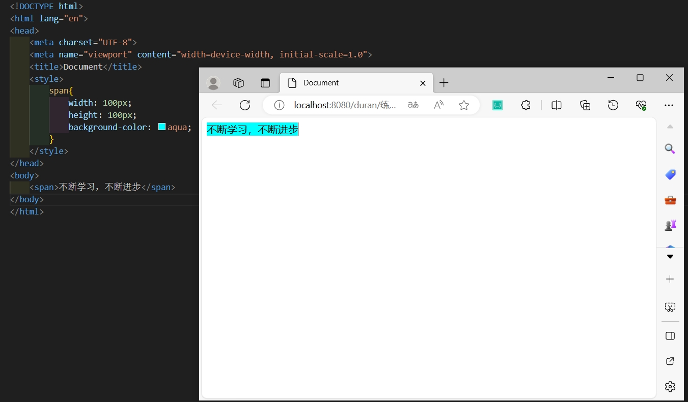
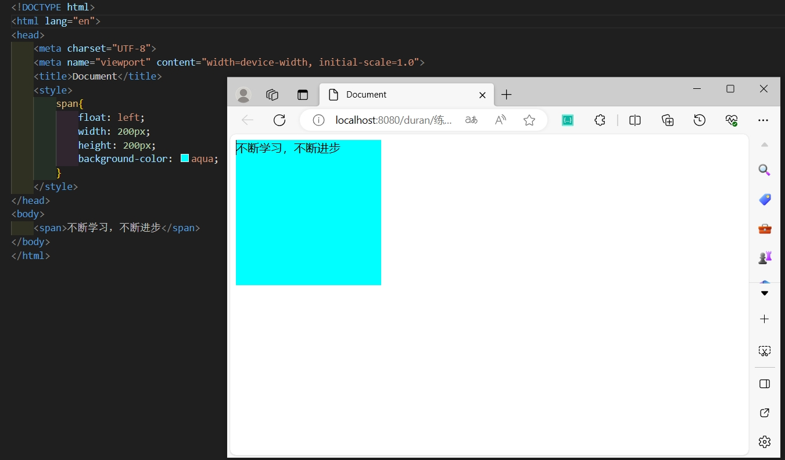
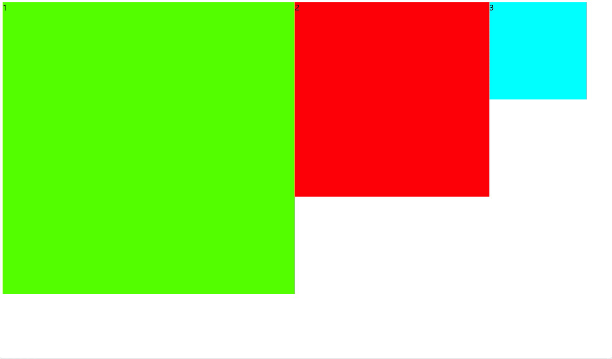
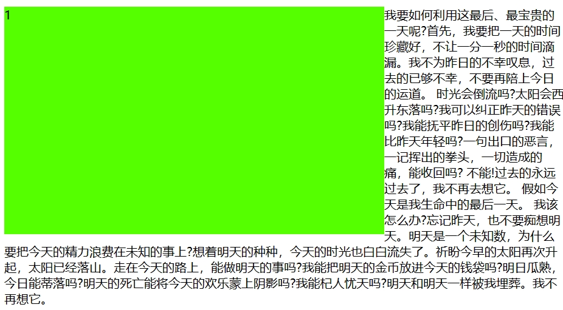
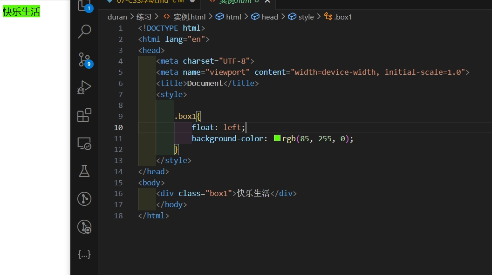
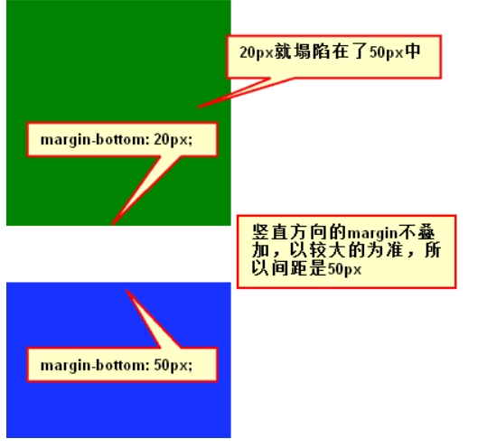

# 浮动

元素的水平方向浮动，意味着元素只能左右移动而不能上下移动。

一个浮动元素会尽量向左或向右移动，直到它的外边缘碰到包含框或另一个浮动框的边框为止。

浮动元素之后的元素将围绕它。

浮动元素之前的元素将不会受到影响。
当把几个浮动的元素放到一起，如果有空间的话，它们将彼此相邻。

## 标准文档流

页面的支座，是个“流”，从上而下，跟织毛衣一样

### 特性

1. 空白折叠现象：
   无论多少个空格、换行、tab，都会折叠为一个空格。
2. 高矮不齐，底边对齐
3. 自动换行

### 行内元素和块级元素

**行内元素和块级元素的区别：**

行内元素：

- 与其他行内元素并排；
- 不能设置宽、高。默认的宽度，就是文字的宽度。

块级元素：

- 霸占一行，不能与其他任何元素并列；
- 能接受宽、高。如果不设置宽度，那么宽度将默认变为父亲的100%。

**行内元素和块级元素的分类：**

从HTML的角度来讲，标签分为：

- 文本级标签：p、span、a、b、i、u、em。
- 容器级标签：div、h系列、li、dt、dd。

从CSS的角度讲，CSS的分类和上面的很像，就p不一样：

- 行内元素：除了p之外，所有的文本级标签，都是行内元素。p是个文本级，但是是个块级元素。

- 块级元素：所有的容器级标签都是块级元素，还有p标签。

### 行内元素和块级元素的相互转换

我们可以通过`display`属性将块级元素和行内元素进行相互转换。display即“显示模式”。

#### 块级元素可以转换为行内元素

一旦，给一个块级元素（比如div）设置：

```css
display: inline;
```

那么，这个标签将立即变为行内元素，此时它和一个span无异。inline就是“行内”。也就是说：

- 此时这个div不能设置宽度、高度；
- 此时这个div可以和别人并排了。

#### 行内元素转换为块级元素

同样的道理，一旦给一个行内元素（比如span）设置：

```css
display: block;
```

那么，这个标签将立即变为块级元素，此时它和一个div无异。block”是“块”的意思。也就是说：

- 此时这个span能够设置宽度、高度
- 此时这个span必须霸占一行了，别人无法和他并排
- 如果不设置宽度，将撑满父亲

## 设置浮动

值：

- left
- right
- none
- inherit

## 浮动的性质

### 浮动元素脱离文档流



上图中，在默认情况下，两个div标签是上下进行排列的。现在由于float属性让上图中的第一个`<div>`标签出现了浮动，于是这个标签在另外一个层面上进行排列。而第二个`<div>`还在自己的层面上遵从标准流进行排列

span标签在标准流中，是不能设置宽高的（因为是行内元素）。

但是，一旦设置为浮动之后，即使不转成块级元素，也能够设置宽高了。

### 浮动元素的互相贴靠

三个div均设置了`float: left;`属性之后，然后设置宽高。当改变浏览器窗口大小时，可以看到div的贴靠效果：

3号若有足够的空间，那么就是会靠着2号，若果没有足够的空间，会靠着1号。
若没有足够的空间去靠着1号那么3号会去紧贴最左边。


示例中是以`float：left`为例，`float：right`的效果是一样的,不过是方向相反。

### 浮动的元素有围绕效果


如上图所示，div挡住了p，文字围绕在div周围。
**标准流中的文字不会被浮动的盒子遮挡住**
**永远不是一个东西单独浮动，浮动都是一起浮动，要浮动，大家都浮动。**

### 收缩

一个浮动的元素，如果没有设置width，那么将自动收缩为内容的宽度（这点非常像行内元素）

div本身是块级元素，如果不设置width，它会单独霸占整行；但是，设置div浮动后，它会收缩。

## 清除浮动

元素浮动之后，周围的元素会重新排列，为了避免这种情况，使用 clear 属性。
clear 属性指定元素两侧不能出现浮动元素。

值：

- left
- right
- both
- none
- inherit

```css
.text_line
{
    clear:both;
}
```

### 方法1 给浮动元素的祖先元素增加高度

浮动元素的祖先元素，没有高度的话，会导致浮动的元素，无法在内部进行正确的浮动。所以需要给设置一个合适的高度（大于等于浮动元素的高度），以保证浮动元素可以在内部正常浮动。

**如果一个元素要浮动，那么它的祖先元素一定要有高度。**

**有高度的盒子，才能关住浮动**。

只要浮动在一个有高度的盒子中，那么这个浮动就不会影响后面的浮动元素。所以就是清除浮动带来的影响了。
方法一在工作中很少用到，页面是快速变化的。

### 方法二 clear：both

clear就是清除，both指的是左浮动、右浮动都要清除。`clear:both`的意思就是：**不允许左侧和右侧有浮动对象。**

这种方法有一个非常大的、致命的问题，**它所在的标签，margin属性失效了**。

### 方法三 隔墙法

给浮动元素添加一个空的div，设置clear：both，此时浮动元素可以正常浮动，祖先元素不受影响。

### 方法四 overflow:hidden

我们可以使用如下属性：

```css
overflow:hidden;
```

overflow即“溢出”， hidden即“隐藏”。这个属性的意思是“溢出隐藏”。所有溢出边框的内容，都要隐藏掉。
`overflow:hidden;`的本意是清除溢出到盒子外面的文字。
给父元素加上`overflow:hidden`; 那么，父元素就能被子元素撑出高了。

## margin 相关问题

### margin重叠

**标准文档流中，竖直方向的margin不叠加，取**较大的值**作为margin(水平方向的margin是可以叠加的，即水平方向没有塌陷现象)。

若不在标准流中，比如盒子都浮动了，那么两个盒子之间是没有塌陷的

### 盒子居中

margin的值可以为auto，表示自动。当left、right两个方向都是auto的时候，盒子居中了.
`margin:0 auto`

注意：

- 只有标准流的盒子，才能使用`margin:0 auto;`居中。也就是说，当一个盒子浮动了、绝对定位了、固定定位了，都不能使用margin:0 auto;
- 使用`margin:0 auto;`的盒子，必须有width，有明确的width。（可以这样理解，如果没有明确的witdh，那么它的witdh就是霸占整行，没有意义）
- `margin:0 auto;`是让盒子居中，不是让盒子里的文本居中。文本的居中，要使用`text-align:center;`（适用于盒子中的文本）

### 子元素的margin

当给子元素一个一个`margin-top:50px;`的属性，让其与父亲保持50px的上边距。结果会出现父元素整体距离边框50px，可以给父元素加上border属性，就会解决这一问题

**margin这个属性，本质上描述的是兄弟和兄弟之间的距离； 最好不要用这个margin表达父子之间的距离。**

如果要表达父子之间的距离，我们一定要善于使用父亲的padding，而不是儿子的margin。
