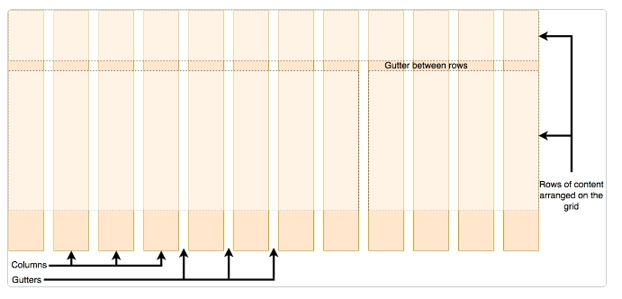
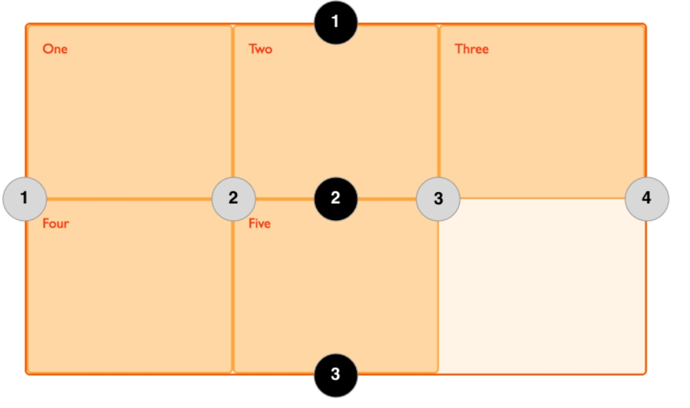
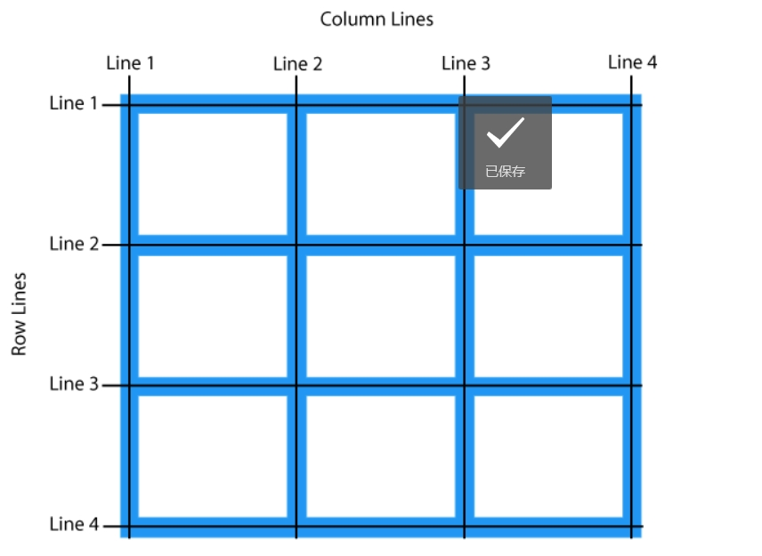
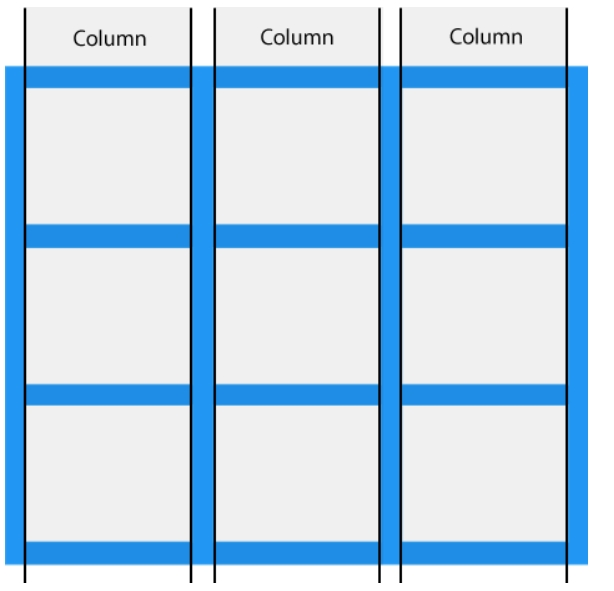
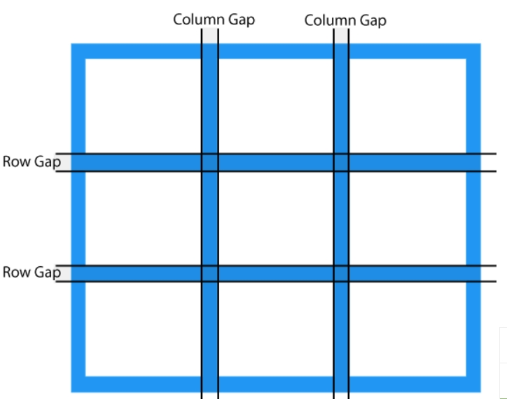

# 网格

- 网格是一个用于 web 的二维布局系统。利用网格，你可以把内容按照行与列的格式进行排版。另外，网格还能非常轻松地实现一些复杂的布局。
- 网格是由一系列水平及垂直的线构成的一种布局模式。根据网格，我们能够将设计元素进行排列，帮助我们设计一系列具有固定位置以及宽度的元素的页面，使我们的网站页面更加统一。
- 一个网格通常具有许多的列（column）与行（row），以及行与行、列与列之间的间隙，这个间隙一般被称为沟槽（gutter）。


## 定义网格

- display 属性设置为 grid 或 inline-grid 后，它就变成了一个网格容器，这个元素的所有直系子元素将成为网格元素。
- 在定义网格后，网页并不会马上发生变化。因为 display: grid 的声明只创建了一个只有一列的网格，所以子项还是会像正常布局流那样，自上而下、一个接一个的排布。

## fr单位

- 轨道可以使用任何长度单位进行定义。
- 网格引入了 fr 单位来帮助我们创建灵活的网格轨道。一个 fr 单位代表网格容器中可用空间的一等份。

```css
.container {
  display: grid;
  grid-template-columns: 1fr 1fr 1fr;
}//创建3个宽度为1fr的列
grid-template-columns: 2fr 1fr 1fr;//一列被分配了 2fr 可用空间，余下的两列各被分配了 1fr 的可用空间，
```

## 网格线

列与列，行与行之间的交接处就是网格线。
网格会为我们创建编号的网格线来让我们来定位每一个网格元素。
下面这个三列两行的网格中，就拥有四条纵向的网格线（灰色圆圈标记），以及三条横向的网格线（黑色圆圈标记）。

网格线的编号顺序取决于文章的书写模式。在从左至右书写的语言中，编号为 1 的网格线位于最左边。在从右至左书写的语言中，编号为 1 的网格线位于最右边。


## 网格行、列

网格元素的垂直线方向称为列（Column）。

网格元素的水平线方向称为行（Row）。


## 网格间距

网格间距（Column Gap）指的是两个网格单元之间的网格横向间距或网格纵向间距。

使用以下属性来调整间隙大小

- grid-column-gap
- grid-row-gap
- grid-gap(是 grid-row-gap 和 the grid-column-gap 属性的简写)

```css
.grid-container {
  display: grid;
  grid-gap: 50px 100px;//两个值表示grid-row-gap和grid-column-gap
}
grid-gap: 50px;//同时设置行间距和列间距。
```

## 基于线的元素放置

根据分割线设置元素，通过以下属性来指定从那条线开始到那条线结束。

- grid-column-start
- grid-column-end
- grid-row-start
- grid-row-end
值均为分隔线序号，也可以缩写为`grid-column grid-row`

```css
header {
  grid-column: 1 / 3;
  grid-row: 1;//占据第一行，1-3列
}

article {
  grid-column: 2;
  grid-row: 2;//占据第2行第2列
}

aside {
  grid-column: 1;
  grid-row: 2;//占据第1列第二行
}
```

## 网格轨道

通过 `grid-template-columns` 和 `grid-template-rows` 属性来定义网格中的行和列。
这些属性定义了网格的轨道，一个网格轨道就是网格中任意两条线之间的空间。

## 使用 grid-template-areas 属性放置元素

使用规则如下：

- 你需要填满网格的每个格子
- 对于某个横跨多个格子的元素，重复写上那个元素grid-area属性定义的区域名字
- 所有名字只能出现在一个连续的区域，不能在不同的位置出现
- 一个连续的区域必须是一个矩形
- 使用.符号，让一个格子留空。

```css
.container {
  display: grid;
  grid-template-areas:
    "header header"
    "sidebar content"
    "footer footer";
  grid-template-columns: 1fr 3fr;
  gap: 20px;
}
```

## minmax（）函数

网页上某个元素的尺寸在不同情况下会变成多少，一些额外的内容或者更大的字号就会导致许多能做到像素级精准的设计出现问题，可以使用minmax()函数
minmax() 函数为一个行/列的尺寸设置了取值范围。比如设定为 minmax(100px, auto)，那么尺寸就至少为 100 像素，并且如果内容尺寸大于 100 像素则会根据内容自动调整

```css
.container {
  display: grid;
  grid-template-columns: repeat(3, 1fr);
  grid-auto-rows: minmax(100px, auto);
  grid-gap: 20px;
}
//我们修改的是 grid-auto-rows，因此只会作用于隐式网格。这一项属性也可以应用于显式网格，
```

## 重复构建

可以使用repeat来重复构建具有某些宽度配置的某些列

```css
.container {
  display: grid;
  grid-template-columns: repeat(3, 1fr);
  grid-gap: 20px;
}
```

第一个传入 repeat 函数的值（3）表明了后续列宽的配置要重复多少次，而第二个值（1fr）表示需要重复的构建配置，这个配置可以具有多个长度设定。
例如repeat(2, 2fr 1fr)，这相当于填入了 2fr 1fr 2fr 1fr。

## 自动使用多列填充

让网格自动创建很多列来填满整个容器。通过设置grid-template-columns属性，我们可以实现这个效果，用到 repeat() 函数中的一个关键字auto-fill来替代确定的重复次数。而函数的第二个参数，我们使用minmax()函数来设定一个行/列的最小值，以及最大值 1fr。

```css
.container {
  display: grid;
  grid-template-columns: repeat(auto-fill, minmax(200px, 1fr));
  grid-auto-rows: minmax(100px, auto);
  grid-gap: 20px;
}
```

形成了一个包含了许多至少 200 像素宽的列的网格，将容器填满。随着容器宽度的改变，网格会自动根据容器宽度进行调整，每一列的宽度总是大于 200 像素，并且容器总会被列填满。