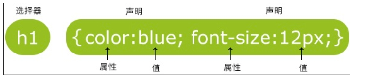

# CSS学习

## 简介

CSS是指层叠样式表（简单来说就是给HTML穿上衣服）

样式通常存储在样式表中；外部样式表可以极大的提高工作效率；

多个样式定义可层叠为一个。

## 语法

CSS规则主要有两个部分组成：选择器，以及一条或多条生明：


选择器通常是您需要更改的HTML元素；每个生命由一个属性和一个值组成

注释以`/*`开始，以`*/`结束，在这个之间的内容，浏览器回忽略。

## 选择器

一、 id选择器

id选择器可以为标有特定id的HTML元素指定特定的样式。

HTML元素以id属性来设置id选择器，CSS中id选择器则以`#`来定义。
```css
#cs1{
    color:red;
    background:blue;
}
```

二、 class选择器

class选择器（又称类选择器）用于描述一组元素的样式。class选择器可以在多个元素中使用。

class属性在HTML中以class属性表示，在CSS中类选择器以一个`.`表示。
```
/*p元素使用"class=center",段落为红色*/
.center{
    color:red;
}
```

id选择器和class选择器的命名，第一个字符不能使用数字。

三、 属性选择器
通过元素的属性选择 HTML 元素。属性选择器可以根据属性名和属性值进行选择。
```
input[type="text"] {
  border: 1px solid gray;
} #input[type="text"] 选择器将选择所有 type 属性为 "text" 的 <input> 元素。
```

四、 元素选择器
通过元素名称选择HTML元素
```
p {
  color: blue;
} #通过p选择器选择所有<p>元素
```

五、 后代选择器
通过指定元素的后代关系选择 HTML 元素。后代选择器使用空格分隔元素名称。
```
div p {
  color: red;
} 
#div p 选择器将选择所有在 <div> 元素内的 <p> 元素。
```

六、伪类选择器

伪类是选择器的一种，用于选择处于特定状态的元素，例如鼠标指针悬浮在元素上面的时候，可以帮助在你标记的文本中减少多余的类，让你的代码更灵活，更易于维护。

伪类就是开头为冒号的关键字
```
:pseudo-class-name
```

1.用户行为伪类
用户以某种方式和文档交互的时候应用，有时候也叫做动态伪类
```
:hover——上面提到过，只会在用户将指针挪到元素上的时候才会激活，一般就是链接元素。
:focus——只会在用户使用键盘控制，选定元素的时候激活。
```

2.伪元素

伪元素以类似方式表现，不过表现得像是往标记文本中加入全新的 HTML 元素一样，而不是向现有的元素上应用类。伪元素开头为双冒号`::`
```
::pseudo-element-name
```

## 创建

一、 外部样式表

当样式需要应用于很多页面时，外部样式表是最理想的选择。可以使用`<link>`标签连接到样式表，在文档的头部。
```
<head>
  <link rel="stylesheet" type="text/css" href="mstyle.css">
</head>
```

二、内部样式表

当文档需要特殊的样式时，可以使用内部样式表，可以使用`<style></style>`在文档的头部定义内部样式
```
<head>
  <style>
        hr {color:sienna;}
        p {margin-left:20px;}
        body{background-image:url("images/back40.gif");}
    </style>
</head>
```

三、内联样式

表现和内容混在一起，内联样式会损失掉样式表的许多优势，使用此样式，需要在相关的标签内使用样式属性，style可以包含任何CSS属性。
```
<p style="color:sienna;margin-left:20px">这是一个段落。</p>
```

四、样式的优先级

一般情况下：优先级如下所示
（内联样式）Inline style > （内部样式）Internal style sheet >（外部样式）External style sheet > 浏览器默认样式