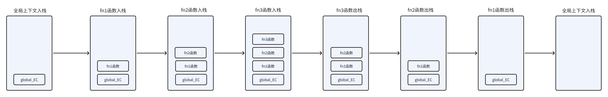

# 执行上下文（EC）

## 定义

当引擎解析到可执行代码时，会创建对应的 "执行上下文(EC)" 也可以叫做执行环境。也就是代码执行所处的环境。

JavaScript代码就是在执行上下文中运行的。

## 类型

在JavaScript中，执行上下文主要分为以下几种：

- **全局执行上下文（Global Execution Context）：**全局执行上下文是最重要的一个执行环境，是 JavaScript 代码运行时的默认环境。一个程序中只会有一个全局执行上下文，具有唯一性。
- **函数执行上下文（Function Execution Context）：**在JavaScript中，每个函数都有自己的执行上下文。每当一个函数被调用时，就会为该函数创建一个新的执行上下文。一个程序中可以有多个函数执行上下文。函数执行上下文可以访问全局执行上下文，反之则不行。
- **eval 函数执行上下文：** eval 函数在执行时，也会创建属于自己的执行上下文但是 eval 函数很少使用。

## 与作用域的区别

执行上下文是在代码执行时可以改变的环境。

作用域则是在定义时就确定了，不能改变的。

## 生命周期

执行上下文是在引擎执行阶段进行的。

执行上下文的生命周期包括三个阶段：创建阶段→执行阶段→回收阶段

代码的执行：首先会进入调用栈，并进入全局执行上下文。紧接着在创建词法环境，此时变量提升、函数提升；紧接着进入执行阶段执行可以执行的代码，有函数就会创建一个函数执行上下文，并压入栈中，同时创建函数的此法环境，函数执行完成以后，从调用栈中弹出，反复循环，直至剩下全局执行上下文，只有关闭浏览器，才会弹出。

## 执行上下文栈

```js
function fn1(){
  fn2();
}
function fn2(){
  fn3();
}
function fn3(){
  console.log('fn3');
}
fn1();
```

1. 创建了全局执行上下文，压入执行栈中。
2. 调用了fn1函数，创建了fn1函数的执行上下文。并压入执行栈中。
3. 进入fn1函数内部，调用了fn2函数，创建fn2的执行上下文，并压入执行栈中。
4. 进入fn2函数内部，调用了fn3函数，创建fn3的执行上下文，并压入执行栈中。
5. fn3函数执行完毕，将fn3函数移出执行栈。
6. fn2函数执行完毕，将fn2函数移出执行栈。
7. fn1函数执行完毕，将fn1函数移出执行栈。
8. 所有代码执行完毕，回到全局执行上下文，当程序退出或者关闭浏览器或者网页，全局执行上下文才会出栈。



注意：

1. JavaScript是单线程运行只有执行栈中顶部的上下文执行完毕，
   退出以后，之后的执行上下文才会继续执行。
2. 全局执行上下文永远是第一个入栈，最后一个出栈。当前函数的执行上下文
   最后一个入栈，位于栈顶。
3. 执行上下文出栈以后，保存在这个环境中的所有的变量和函数会随之销毁。

>特点先进后出
