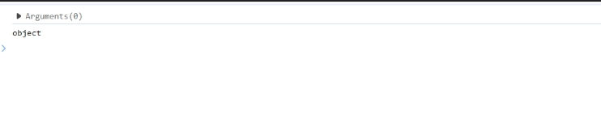

# this

## this指向

解析器会在调用函数时每次都向函数内部传递一个隐含的参数，这个参数就是this，可以在方法中使用以指代当前对象。

根据函数的调用方式不同，this会指向不同的对象：

- 以函数的形式调用时，this永远都是window。例如obj（）；相当于window.obj();
- 以方法的形式调用时，this是调用方法的那个对象
- 以构造函数的形式调用时，this时新创建的那个对象
- 使用call和apply调用时，this是指定的那个对象

示例1：

```js

function obj(){
  console.log(this);
  console.log(this.name);
}
var obj1 = {
  name : "Tom",
  sayName : obj 
};

var obj2 = {
  name : "Kom",
  sayName : obj
};

var name = "全局的name"；
obj()
打印结果
window
全局的name
```

可以看出示例中，this指向的是window对象，所以this.name指的是全局的name。

示例2

```js

function obj(){
  console.log(this);
  console.log(this.name);
}

var obj1 = {
  name : "Tom",
  sayName : obj 
};

var name = "全局中的name";
obj1.sayName();

打印结果
Object
Tom
```

从上面的示例可以看出this指向的是对象obj1，this.name指向的是obj1.name。以方法形式调用的时候，this指向的是调用方法的那个对象。

箭头函数中的this指向：

ES6中箭头函数并不会遵循上面所阐述的四条规则，则会继承外层函数调用的this绑定(无论this绑定的是什么)

## 类数组arguments

在调用函数时，浏览器每次都会默认传递两个隐含的参数：

1. 函数的上下文对象this
2. 封装实参的对象arguments

```js

function obj (){
  console.log(arguments);
  console.log(typeof arguments);
}

obj();
```
运行结果：


arguments是一个类数组对象，可以通过索引来操作数据，也可以获取长度

arguments代表的时实参，只在函数中使用。在调用函数的时候，所传递的实参都会在arguments中保存。

### 返回函数实参的个数

arguments.length可以用来获取**实参的长度**。

```js
obj(2,4);
obj(2,4,6);

  function obj(a,b) {
​    console.log(arguments);
​    console.log(obj.length);     //获取形参的个数
​    console.log(arguments.length);  //获取实参的个数
  }
```

### 返回正在执行的函数

arguments.callee，callee这个属性对应一个函数对象，就是当前正在指向的函数对象。

```js
function obj(){
  console.log(arguments.callee == obj);
  //打印结果为true
}
obj("tom");
```

在使用递归函数时，可以使用arguments.callee代替函数名本身。

### 可以修改元素

arguments可以修改元素，但不能改变数组的长短，这就是说arguments时伪数组的原因。

```js
obj(6,12);

function obj(a,b){
  arguments[0] = 66;
  arguments.push(8);//此方法不通过，因为无法增加元素
}
```
