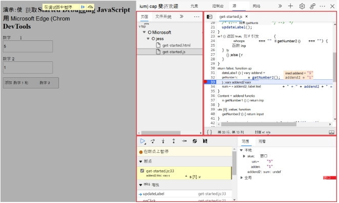
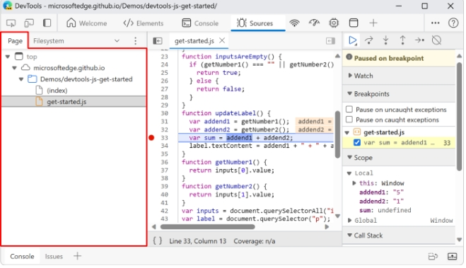
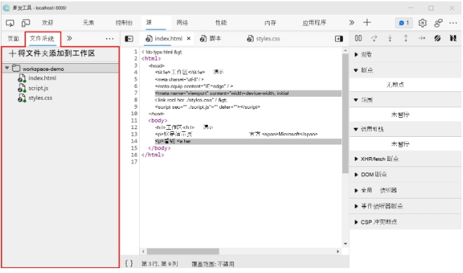
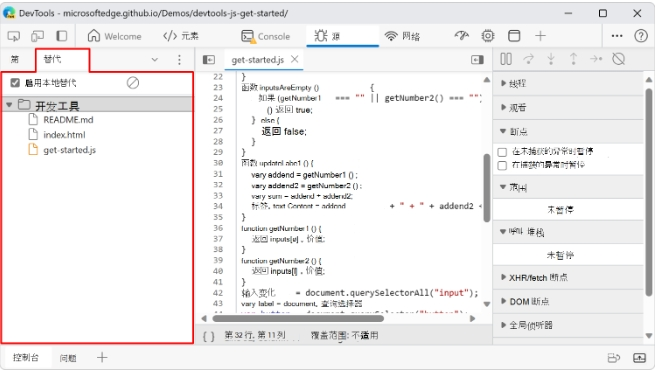
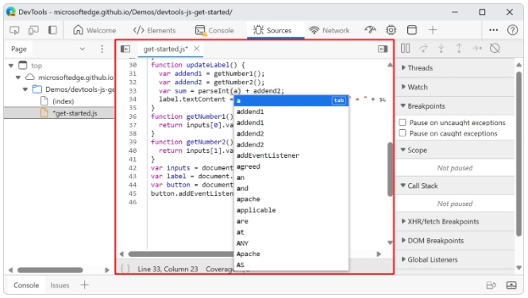
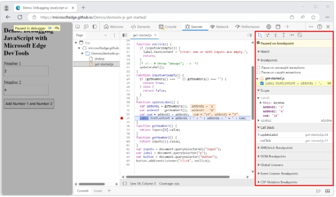
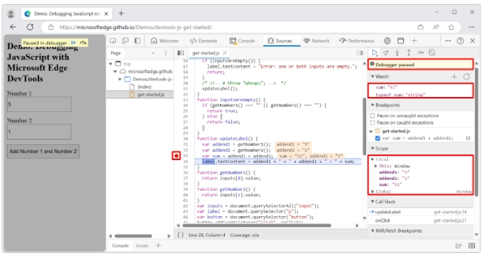

# 源工具

使用“源”工具查看、修改和调试JavaScript代码，并检查当前网页的资源。

|窗格     | 操作 |
| ----------- | ----------- |
| 导航器窗格      | 在从服务器返回的资源之间导航以构建当前网页。 选择文件、图像和其他资源，并查看其路径。 （可选）设置本地 Workspace 以将更改直接保存到源文件。       |
| 编辑器窗格  | 查看从服务器返回的 JavaScript、HTML、CSS 和其他文件。 对 JavaScript 或 CSS 进行实验性编辑。 在刷新页面之前，所做的更改将一直保留;如果使用 Workspaces 保存到本地文件，则页面刷新后将保留所做的更改。 使用 Workspaces 或 Overrides 时，也可以编辑 HTML 文件。     |
| 调试器窗格 | 使用 JavaScript 调试器设置断点、暂停运行 JavaScript，并逐步执行代码，包括你进行的任何编辑，同时观察你指定的任何 JavaScript 表达式。 观察并手动更改当前代码行范围内变量的值。 |

下图显示了 导航器 窗格，其中突出显示了 DevTools 左上角的红色框，右上角突出显示了 编辑器 窗格，底部突出显示了 调试器 窗格。 最左侧是浏览器窗口的主要部分，显示呈现的网页灰显，因为调试程序暂停在断点



## 使用导航器窗格选择文件

使用 左侧 ( 导航器窗格) 导航从服务器返回的资源之间导航以构建当前网页。 选择文件、图像和其他资源，并查看其路径。

### 使用"页面"选项卡浏览构建当前网页的资源

使用导航器窗格的"页"选项卡浏览从服务器返回的文件系统以构造当前网页。 选择要查看、编辑和调试的 JavaScript 文件。 " 页面 "选项卡列出了页面已加载的所有资源。



想要编辑器窗格中显示文件，可以在页面中选择一个文件，会在source（源代码）中显示出来页面的代码结构，如果是图片，将显示图片预览。

页面"选项卡中的图标

窗口图标以及标签 top表示main文档框架，即 HTML 框架：**窗口图标**
云图标表示源：**云图标**
文件夹图标表示目录：**文件夹图标**
页面图标表示资源：**页面图标**

### 使用"文件系统"选项卡定义本地 Workspace

在源工具中编辑文件时，刷新网页时会放弃更改。Source工具中所作出的更改不会被保存，若在实际的源代码中更改了，并部署到服务器上才会发生改变。



相反在使用Workspace，刷新网页是，对前端代码所作的更改将会保留。对于Workspace，在编辑服务器返回前端代码的，源工具还会将编辑应用在本地源代码中。若服务器返回的JavaScript代码与本地的源代码相同，工作区可以正常工作。当工作流设计源代码的转换，工作区不能正常工作。

### 使用"覆盖"选项卡覆盖包含本地文件的服务器文件

使用导航器窗格的"替代"选项卡，使用本地文件夹中的文件替代页面文件。


此选项卡中的项目会覆盖服务器发送到浏览器的内容，即使服务器已发送资产。

### 将"内容脚本"选项卡用于Microsoft Edge扩展

使用导航器窗格的内容脚本选项卡查看已安装的Microsoft Edge扩展插件加载的任何内容脚本。

### 使用"代码段"选项卡在任何网页上运行 JavaScript 代码段

使用导航器窗格的代码片段选项卡创建和保存 JavaScript 代码片段，以便可以在任何网页上轻松运行这些代码片段。

### 使用编辑器窗格查看或编辑文件

使用 " 编辑器"窗格查看从服务器返回的前端文件，以撰写当前网页，包括 JavaScript、HTML、CSS 和图像文件。 在 编辑器 窗格中编辑前端文件时，DevTools 会更新网页以运行修改后的代码。


## 编辑 JavaScript 文件

若要编辑 JavaScript 文件，请在源工具中使用编辑器窗格。

### 保存和撤销

若要使 JavaScript 更改生效，请按 Ctrl+S (Windows、Linux) 或 Command+S (macOS) 。

如果更改文件，文件名旁边将出现一个星号。

若要保存更改，请在 Windows/Linux 上按 Ctrl+S 或在 macOS 上按 Command+S 。
若要撤消更改，请在 Windows/Linux 上按 Ctrl+Z 或在 macOS 上按 Command+Z 。

### 查找和替换

若要在当前文件中查找文本，请选择 “编辑器 ”窗格以使其具有焦点，然后在 Windows/Linux 上按 Ctrl+F ，或在 macOS 上按 Command+F 。

若要查找和替换文本，请选择“查找”文本框左侧的“替换 (A-B>) ”按钮。 查看可编辑文件时，将显示“替换 (A-B>) ”按钮。

## 使用调试器窗格调试 JavaScript 代码

使用 JavaScript 调试程序逐步调试服务器返回的 JavaScript 代码。 调试器包括 调试器 窗格，以及在 编辑器 窗格中的代码行上设置的断点。

借助调试器，你可以逐步调试代码，同时观察你指定的任何 JavaScript 表达式。 观察并手动更改变量值，并自动显示当前语句范围内哪些变量。

调试器支持标准调试操作，例如：

设置断点以暂停代码。
逐步执行代码。
查看和编辑属性和变量。
监视 JavaScript 表达式的值。
查看调用堆栈（到目前为止函数调用的序列.

### 使用调试器的基本方法

若要对 JavaScript 代码进行故障排除，可以在代码中插入 console.log() 语句。 另一种更强大的方法是使用 DevTools Microsoft Edge调试器。 熟悉调试器方法后，使用调试器实际上可以比 console.log() 更简单。

- 右键单击网页中的任意位置，然后选择“检查”。 或者，按 F12。 DevTools 窗口随即打开，位于演示网页旁边。

- 在 DevTools 中，选择“源”选项卡。

- 在 导航器 窗格（左侧）中，选择 页 选项卡，然后选择 JavaScript 文件，例如 get-started.js。

- 在 "编辑器 "窗格中，选择可疑代码行附近的行号，以在该行上设置断点。 在下图中，在 行 上设置了断点 var sum = addend1 + addend2;。

- 在网页中，输入值并提交表单。 例如，输入数字（如 5 和 1），然后选择按钮 添加数字 1 和数字 2。

- 调试程序运行 JavaScript 代码，然后在断点处暂停。 调试程序现在进入暂停模式，因此你可以检查范围内属性的值，并逐步执行代码。



在上图中，我们添加了 Watch 表达式和 ，并跨 sumtypeof sum 断点添加了两行。

- 检查"范围"窗格中 的值， 其中显示当前断点范围内的所有变量或属性及其值。此时，可以在“观看”窗格中添加表达式。 这些表达式与在语句中编写以调试代码 console.log 的表达式相同。

- 若要运行 JavaScript 命令以操作当前上下文中的数据，请使用控制台。 如果要在 DevTools 底部的抽屉中打开控制台，请按 Esc。

- 使用 “调试器 ”窗格顶部的控件（如 步骤 (F9) ）逐步完成代码。此演示中的 bug 是你需要首先将输入数据从字符串转换为数字。

- 若要修复此 bug，请刷新页面以重置网页窗体，然后更改行：

```JavaScript
var sum = addend1 + addend2;
收件人:
var sum = parseInt(addend1) + parseInt(addend2);
```

- 按 Ctrl+S (Windows、Linux) 或 Command+S (macOS) 保存本地缓存文件中的更改。

- 在网页中输入 5 和 1 ，然后单击“ 添加 ”按钮。 现在，范围>本地>总计：是数字 6，而不是字符串“51”。

### 调试器监视和作用域比 console.log 的优点

这三种方法是等效的：

- 临时添加 语句 console.log(sum) 和 console.log(typeof sum) 代码，其中 sum 位于范围内。

- 当调试器在sum在范围内时暂停时，在 DevTools 的控制台窗格中发出语句sum和console.log(typeof sum)。

- 设置 监视表达式sum 和 typeof sum 调试 器窗格中 的。

调试程序提供比语句更丰富、更灵活的显示 console.log 和环境。 例如，在调试器中，在逐步调试代码时，可以显示和更改所有当前定义的属性和变量的值。 还可以在 控制台中发出 JavaScript 语句，例如更改范围内数组中的值。
刷新网页时，将保留断点和监视表达式。
