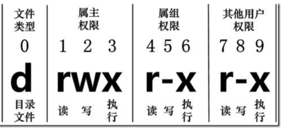

# Linux文件管理

## 基本属性

通过以下两个命令来修改文件或目录的所属用户与权限。

```linux
chown (change owner) ： 修改所属用户与组。
chmod (change mode) ： 修改用户的权限
```


```linux
duran@DESKTOP-J4VTE5S:~$ ls -l
total 4
drwxr-xr-x 8 duran duran 4096 Nov 20 20:22 LearnTem
```

示例中，bin文件的第一个属性用`d`表示，代表该文件是一个目录文件，在Linux中第一个字符代表这个文件是目录、文件或链接文件等等。

1. 当为 `d` 则是目录;
2. 当为 `-`则是文件；
3. 若是`l`则表示为链接文档(link file)；
4. 若是 `b` 则表示为装置文件里面的可供储存的接口设备(可随机存取装置)；
5. 若是 `c` 则表示为装置文件里面的串行端口设备，例如键盘、鼠标(一次性读取装置)。

接下来的字符中，三个为一组，均包含`rwx`的三个参数的组合，其中`r`代表可读、`w`代表可写、`x`代表可执行，三个权限的位置不会改变，如果没有权限，就会出现减号`-`。

每个文件的属性由左边第一部分的10个字符来决定。如下图所示


## 文件属主和属组


LearnTem是目录文件，属主和属组都为duran，属主权限为读、写、执行，属组权限读、执行，其他用户权限读、执行。

## 更改文件属性

1. chagrp:更改文件属组

```linux
chgrp [-R] 属组名 文件名
-R 递归更改文件数组，就是在更改某个陌路文件的属组时，加上该参数，目录下的所有文件的属组都会更改

```

2. chown：更改文件所有者（owner），也可以更改文件所属组。

```linux
chown [-R] 所有者 文件名
chown [-R] 所有者：属组名 文件名
```

3. chmod：更改文件的9个属性

Linux文件属性有两中设置方法，一种是数字，一种是符号。

文件的权限字符为：`-rwxrwxrwx`,数字权限对应为`r:4`,`w:2`,`x:1`;`rwx=4+2+1=7`

```linux
chomd [-R] xyz 文件或目录
xyz : 就是刚刚提到的数字类型的权限属性，为 rwx 属性数值的相加。
-R : 进行递归(recursive)的持续变更，以及连同次目录下的所有文件都会变更
```

符号类型改变文件权限

- user：用户
- group：组
- others：其他

可以用u，g，o代表三种身份的权限，a代表all，即全部的身份

- 加入：+
- 除去：-
- 设定：= 

```linux
chomd u/g/o/a +/-= r/w/x 文件或目录
chomd u=rwx,g=rx,o=r test #更改test属主和属组
chomd a-x test  #拿掉全部人的可执行权限
```
