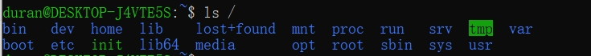

# Linux系统目录结构

输入以下命令`ls /`会看到下图

1. 系统启动必须项
   1. /boot：存放的启动Linux 时使用的内核文件，包括连接文件以及镜像文件。
   2. /etc：存放所有的系统需要的配置文件和子目录列表，更改目录下的文件可能会导致系统不能启动。
   3. /lib：存放基本代码库（比如c++库），其作用类似于Windows里的DLL文件。几乎所有的应用程序都需要用到这些共享库。
   4. /sys： 这是linux2.6内核的一个很大的变化。该目录下安装了2.6内核中新出现的一个文件系统 sysfs 。sysfs文件系统集成了下面3种文件系统的信息：针对进程信息的proc文件系统、针对设备的devfs文件系统以及针对伪终端的devpts文件系统。该文件系统是内核设备树的一个直观反映。当一个内核对象被创建的时候，对应的文件和目录也在内核对象子系统中
2. 外部文件管理
   1. /dev ：Device(设备)的缩写, 存放的是Linux的外部设备。注意：在Linux中访问设备和访问文件的方式是相同的。
   2. /media：类windows的其他设备，例如U盘、光驱等等，识别后linux会把设备放到这个目录下。
   3. /mnt：临时挂载别的文件系统的，我们可以将光驱挂载在/mnt/上，然后进入该目录就可以查看光驱里的内容了。
3. 指令集合
   1. /bin：存放着最常用的程序和指令
   2. /sbin：只有系统管理员能使用的程序和指令。
4. 临时文件
   1. /run：是一个临时文件系统，存储系统启动以来的信息。当系统重启时，这个目录下的文件应该被删掉或清除。如果你的系统上有 /var/run 目录，应该让它指向 run。
   2. /lost+found：一般情况下为空的，系统非法关机后，这里就存放一些文件。
   3. /tmp：这个目录是用来存放一些临时文件的。
5. 账户
   1. /root：系统管理员的用户主目录。
   2. /home：用户的主目录，以用户的账号命名的。
   3. /usr：用户的很多应用程序和文件都放在这个目录下，类似于windows下的program files目录。
   4. /usr/bin：系统用户使用的应用程序与指令。
   5. /usr/sbin：超级用户使用的比较高级的管理程序和系统守护程序。
   6. /usr/src：内核源代码默认的放置目录。
6. 运行过程中使用
   1. /var：存放经常修改的数据，比如程序运行的日志文件（/var/log 目录下）。
   2. /proc：管理内存空间！虚拟的目录，是系统内存的映射，我们可以直接访问这个目录来，获取系统信息。这个目录的内容不在硬盘上而是在内存里，我们也可以直接修改里面的某些文件来做修改。
7. 扩展使用
   1. /opt：默认是空的，我们安装额外软件可以放在这个里面。
   2. /srv：存放服务启动后需要提取的数据（不用服务器就是空）

/etc： 上边也提到了，这个是系统中的配置文件，如果你更改了该目录下的某个文件可能会导致系统不能启动。

/bin, /sbin, /usr/bin, /usr/sbin: 这是系统预设的执行文件的放置目录，比如 ls 就是在 /bin/ls 目录下的。

/bin、/usr/bin 是给系统用户使用的指令（除 root 外的通用用户），而/sbin, /usr/sbin 则是给 root 使用的指令。

/var： 这是一个非常重要的目录，系统上跑了很多程序，那么每个程序都会有相应的日志产生，而这些日志就被记录到这个目录下，具体在 /var/log 目录下，另外 mail 的预设放置也是在这里.
