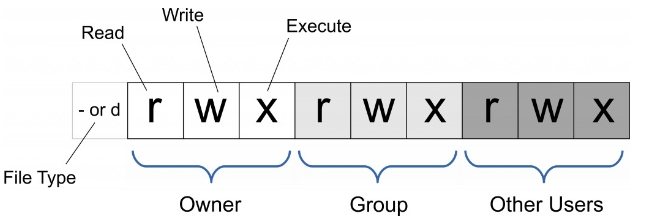
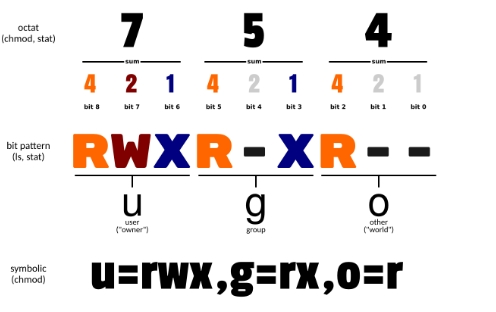

# Shell学习笔记

## 常用命令

### cd  

1. 用于改变当前工作目录的命令，并切换到指定的路径。

```
cd [dirname]   //dirname：表示要切换的目标目录，可以是相对或者绝对路径。
```

2. 切换上级目录。`..`表示上级目录，可通过连续多次使用来切换到更高级的目录

```
cd ..     //切换到上级目录
cd ../../     //切换到上上级目录
```

3. 切换到用户主目录`~`表示当前用户的主目录;`-`可以切换到上次访问的目录。

```
cd ~
cd - 
```
pwd
用于显示工作目录，执行此指令可得知目前所在目录的绝对路径名称
```
pwd [--help][--version]
--help 在线帮助
--version 显示版本信息。
//可直接使用此命令
```

### ls

1. 用于显示指定工作目录下的内容

```
ls -l           # 以长格式显示当前目录中的文件和目录
ls -a           # 显示当前目录中的所有文件和目录，包括隐藏文件
ls -lh          # 以人类可读的方式显示当前目录中的文件和目录大小
ls -t           # 按照修改时间排序显示当前目录中的文件和目录
ls -R           # 递归显示当前目录中的所有文件和子目录
ls -l /etc/passwd   # 显示/etc/passwd文件的详细信息
ls /            #列出根目录（\）下所有的目录
ls -lR /debain  #以长格式显示debain中所有的文件和子目录
```

2. 当文件名含有空格、特殊字符或者开始字符为破折号时，可以使用反斜杠（\）先进行转义，捉着使用引号将文件名括起来

```
ls "my file.txt"    # 列出文件名为"my file.txt"的文件
ls my\ file.txt     # 列出文件名为"my file.txt"的文件
ls -- -filename     # 列出文件名为"-filename"的文件
```

3. 还可以使用通配符进行模式匹配。`*`表示匹配任意字符，`?`表示匹配一个字符，`[...]`表示匹配指定范围内的字符
```
ls *.txt         # 列出所有扩展名为.txt的文件
ls file?.txt     # 列出文件名为file?.txt的文件，其中?表示任意一个字符
ls [abc]*.txt    # 列出以a、b或c开头、扩展名为.txt的文件
``` 

4. 在使用`ls -l`命令时，第一列的字符表示文件或目录的类型和权限，其中第一个字符表示文件类型：
   1. `-` 表示普通文件
   2. d 表示目录
   3. l 表示符号链接
   4. c 表示字符设备文件
   5. b 表示块设备文件
   6. s 表示套接字文件
   7. p 表示管道文件
以上9个字符分别对应三个字符一组的rwx权限
   1. r 表示读取权限
   2. w 表示写入权限
   3. x 表示执行权限
   4. - 表示没有对应权限

### chomd

此命令是控制用户对文件的权限的命令

Linux/Unix 的文件调用权限分为三级 : 文件所有者（Owner）、用户组（Group）、其它用户（Other Users）



也可以使用绝对模式（八进制数字模式），符号模式指定文件的权限。



```
chmod [-cfvR][--help][--version] mode file...
-c : 若该文件权限确实已经更改，才显示其更改动作
-f : 若该文件权限无法被更改也不要显示错误讯息
-v : 显示权限变更的详细资料
-R : 对目前目录下的所有文件与子目录进行相同的权限变更(即以递归的方式逐个变更)
--help : 显示辅助说明
--version : 显示版本
mode:权限设定字串，格式如下
[ugoa..][[+-=][rwxX]...][,....]
u 表示该文件的拥有者，g 表示与该文件的拥有者属于同一个群体(group)者，o 表示其他以外的人，a 表示这三者皆是。
+ 表示增加权限、- 表示取消权限、= 表示唯一设定权限。
r 表示可读取，w 表示可写入，x 表示可执行，X 表示只有当该文件是个子目录或者该文件已经被设定过为可执行。
```

### chattr

用于改变文件属性。具有以下几个属性。

   1. a：让文件或目录仅供附加用途。
   2. b：不更新文件或目录的最后存取时间。
   3. c：将文件或目录压缩后存放。
   4. d：将文件或目录排除在倾倒操作之外。
   5. i：不得任意更动文件或目录。
   6. s：保密性删除文件或目录。
   7. S：即时更新文件或目录。
   8. u：预防意外删除。

```
chattr [-RV][-v<版本号>][+/-/=<属性>][文件或目录]
chattr +i /etc/resolv.conf  #防止resolv被修改
示例：
[root@localhost test]# ll
---xrw-r-- 1 root root 302108 11-13 06:03 log2012.log
[root@localhost test]# chgrp -v bin log2012.log  //将log2012.log群组属性改为bin
```

## 增加

touch
用于修改文件或者目录的时间属性，若文件不存在，则会创建一个新的文件
```
touch 文件名
touch file     #创建一个名为'file'的新的空白文件
touch file   #修改文件的时间属性
ls -l file   #查看文件的时间属性
```
mkdir

用于创建目录

```
mkdir [-p] dirname
-p 确保目录名称存在，不存在就创建一个

mkdir file   #创建一个名为file的子目录
mkdir [-p] file1/test    #在file1的目录中建立一个test的子目录；若不加-p参数，且file1目录不存在，会报错

```


## 删除

rm :用于删除一个文件或者目录
```
rm [options] name..
参数
-i 删除前逐一询问确认。
-f 即使原档案属性设为唯读，亦直接删除，无需逐一确认。
-r 将目录及以下之档案亦逐一删除。
```
删除文件可以直接使用rm命令，若删除目录必须配合选项`-r`
```
rm  test.txt 
rm：是否删除 一般文件 "test.txt"? y  
rm  homework  
rm: 无法删除目录"homework": 是一个目录  
rm  -r  homework  
rm：是否删除 目录 "homework"? y 
rm -r *      #删除当前目录下的所有文件及目录
```

## 修改

cat

用于连接文件
```
cat [-AbeEnstTuv] [--help] [--version] fileName
cat -n textfile1 > textfile2 #把textfile1文档内容加上行号输入到textfile2里面
cat /dev/null > /etc/text.text  #清空/etc/text.text的内容

```

rcp
1. 用于复制远程文件或者目录
2. 用在远端复制文件或者目录
```
rcp [-pr][源文件或目录][目标文件或者目录]
或
rcp [-pr][源文件或目录...][目标文件或者目录]
参数：
-p 　保留源文件或目录的属性，包括拥有者，所属群组，权限与时间。
-r 　递归处理，将指定目录下的文件与子目录一并处理。
```

patch

用于修补文件，修补文件的格式，修改，更新原始文件
```
patch [-bceEflnNRstTuvZ][-B <备份字首字符串>][-d <工作目录>][-D <标示符号>][-F <监别列数>][-g <控制数值>][-i <修补文件>][-o <输出文件>][-p <剥离层级>][-r <拒绝文件>][-V <备份方式>][-Y <备份字首字符串>][-z <备份字尾字符串>][--backup-if -mismatch][--binary][--help][--nobackup-if-mismatch][--verbose][原始文件 <修补文件>] 或 path [-p <剥离层级>] < [修补文件]

```

## 查找

find

用于在指定目录下查找文件和目录。
```
find [path] [expression]
path:是要查找的目录路径，可以是一个目录或文件名，也可以是多个路径，多个路径之间用空格分隔，若未指定路径，则默认为当前目录
expression：是可选参数，用于查找指定的条件，可以是文件名、文件类型、大小等
find . -name file.text      #查找当前目录下名为file.text 文件
find . -name "*.c"          #查找当前目录下所有文件后缀为.c的文件
find /home -size +1M        #查找/home目录下大于1MB的文件
find . -ctime +20           #查找当前目录及其子目录下所有20天前及更早更新过的文件
```

grep

用于查找文件里面符合条件的字符串或正则表达式、查找内容包含指定的范本样式文件。
```
grep [options] pattern [files]
或
grep [-abcEFGhHilLnqrsvVwxy][-A<显示行数>][-B<显示列数>][-C<显示列数>][-d<进行动作>][-e<范本样式>][-f<范本文件>][--help][范本样式][文件或目录...]
pattern - 表示要查找的字符串或正则表达式。
files - 表示要查找的文件名，可以同时查找多个文件，如果省略 files 参数，则默认从标准输入中读取数据。
-i：忽略大小写进行匹配。
-v：反向查找，只打印不匹配的行。
-n：显示匹配行的行号。
-r：递归查找子目录中的文件。
-l：只打印匹配的文件名。
-c：只打印匹配的行数。
```
实例

```
grep hello file.text    #在文件file.text中查找字符串"hello"
grep -r -n pattern dir/     #在文件夹dir中递归查找所有文件中匹配正则表达式"pattern"的行
echo "Hello world" | grep -c world   #在白准输入中查找字符串"world"
grep test *file    #在当前目录中，查找后缀有file字样的文件中包含test字符串的文件。*在前表示后缀，反之前缀。
```

locate 
1. 用于查找符合条件的文件。
2. 是在整个系统内进行快速查找，Linux有一个专门的数据库存放所有的文件名。
3. 非实时性。数据库定期更新一次，所以刚创建的文件可能搜索不到
4. 模糊查询。查找network时，aneworkn也符合条件。
5. 实时性要求不高的查询。
```
locate [选项] 文件
locate /etc/ssh      #搜索etc目录下所有以ssh开头的文件
locate -i ~/r        #忽略大小写搜索当前用户目录下所有的以r开头的文件
```