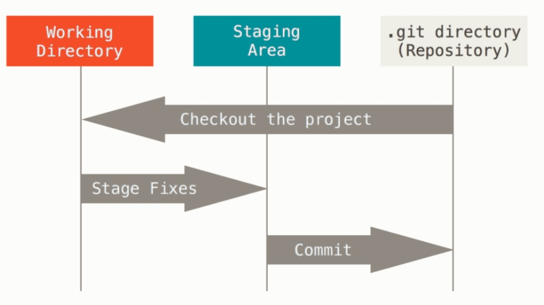
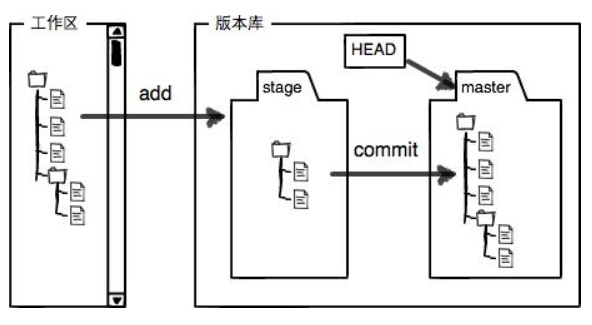

# git分支学习

Git保存的不是文件的变化或者差异，而是一系列不同时刻的快照（）。

在进行提交操作时，Git会保存一个提交对象，提交对象会包含一个指向暂存内容快照的指针、作者的姓名和邮箱、提交时输入的信息以及指向它的父对象的指针。 首次提交产生的提交对象没有父对象，普通提交操作产生的提交对象有一个父对象， 而由多个分支合并产生的提交对象有多个父对象。

讲他们存储的信息看作是一组基本文件和每个文件随时间逐步积累的差异（基于差异的版本控制）。

每次放你体哦叫更新或保存项目状态时，基本上就会对当时的全部文件创建一个快照并保存这个快照的索引。为了效率，若文件没有修改，Git不在重新存储该文件，而是只保留一个链接指向之前存储的文件。

## 三种状态

Git有三种状态，文件可能处于其中之一：已提交（committed）、已修改（modified）和已暂存（staged）。

- 已修改表示修改了文件，但还没保存到数据库中。
- 已暂存表示对一个已修改文件的当前版本做了标记，使之包含在下次提交的快照中。
- 已提交表示数据已经安全地保存在本地数据库中。

Git项目有三个阶段：工作区、暂存区以及Git目录

基本的Git工作流程如下：

- 在工作区中修改文件。
- 将你想要下次提交的更改选择性地暂存，这样只会将更改的部分添加到暂存区。
- 提交更新，找到暂存区的文件，将快照永久性存储到 Git 目录。

若 Git 目录中保存着特定版本的文件，就属于 已提交 状态。 若文件已修改并放入暂存区，就属于 已暂存 状态。 如果自上次检出后，作了修改但还没有放到暂存区域，就是 已修改 状态。
