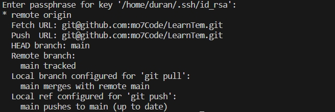

# git学习笔记

## 安装及配置

1. 在linux终端中输入`sudo apt-get install git`.
2. 使用`git --version`来检查安装是否完成
3. 配置相关信息

```git
git config --global user.name xxx  #配置你的用户名
git config --global user.email xxx@xx.com  #配置你的邮箱地址
git config --list  #查询配置是否成功
```

1. 配置密钥

```git
ssh-keygen -t rsa -c 'xxx@xxx.com'
找到生成的密钥
cd ~/.ssh/
将密钥复制在GitHub的SSHkey设置里面
用ssh命令检查是否配置成功
ssh git@github.com
```

## git常用命令

git clone 'ssh地址' #拷贝一个远程仓库，也就是下载一个项目

git add .    #添加文件到暂存区

git commit -m "改动说明"  # 提交暂存区到本地仓库

git push    #上传远程代码并合并

1. 常用与修改、

- git add ：添加文件到暂存区
- git status：查看仓库当前的状态，显示有变更的文件。
- git diff：比较文件的不同，即暂存区和工作区的差异。
- git commit：提交暂存区到本地仓库。
- git reset：回退版本。
- git rm：将文件从暂存区和工作区中删除。

移除某个文件，必须要从一跟踪文件清单中移除（确切来说，是从暂存区中移除），然后提交，可以使用此命令来完成，连带从工作目录中删除指定的文件，这样就不会出现在未跟踪文件清单。如果只是简单的从工作目录中手动删除文件，运行`git ststus`就会在`Changes not staged for commit`部分看到。

- git mv：移动或重命名工作区文件。
- git branch:查看分支
- git checkout：分支切换。
- git switch （Git 2.23 版本引入）：更清晰地切换分支。
- git restore （Git 2.23 版本引入）：恢复或撤销文件的更改。
- git merge:合并某分支到当前分支

1. 提交日志

- git log：查看历史提交记录
  `git log --graph`可以看到分支合并图
  输入q，推出命令
- git blame "文件名"：以列表形式查看指定文件的历史修改记录

2. 远程操作

- git remote：远程仓库操作
  
  想要查看一个远程仓库的更多信息，可以使用`git remote show <remote>`会出现以下内容
  

  列出了远程仓库的URL与跟踪分支的信息。告诉你正处于`main`分支，并且运行`git pull`会抓取所有的远程引用，然后讲远程的`main`分支合并到本地`main`分支，也会列出拉取到的所有的远程引用。

  并且也会列出当你在特定的分支上执行`git push`会自动推动到哪一个远程分支。会列出那些远程分支不在你的本地，那些远程分支已经从服务器上移除了。当执行`git pull`时那些本地分支可以与他跟踪的远程分支自动合并。

- git fetch：从远程获取代码库
  
  - 如果在使用`clon`命令克隆了一个仓库，命令会自动为其添加为远程仓库并默认以“origin”为简写。所以`git fetch origin`会抓取克隆（或上一次抓取）后新推送的所有工作。`git fetch`命令只会讲数据下载你的本地仓库，并不会自动合并或修改你当前的工作。
  - 如果只想取回特定分支的更新，可以指定分支名： git fetch <远程主机名> <分支名> //注意之间有空格
  
  - 最常见的命令如取回origin 主机的master 分支：git fetch origin master
  
- git pull：下载远程代码并合并
  
- git push：上传远程代码并合并
  

