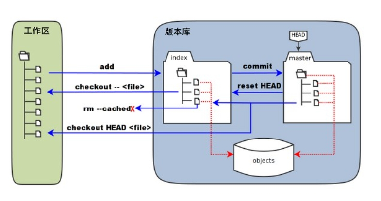

# git学习

## git 工作区、暂存区和版本区

工作区：就是在电脑里能看到的目录
暂存区：一般村房子啊`.git`目录下的index(.git/index)中。所以暂存区有时也叫索引(index)
版本区：工作区有一个隐藏的目录`.git`,d但不算是工作区，而是Git版本库



- 当执行提交操作（`git commit`）时，暂存区的目录树写到版本库（对象库）中，master 分支会做相应的更新。即 master 指向的目录树就是提交时暂存区的目录树。
- 当执行 `git reset HEAD` 命令时，暂存区的目录树会被重写，被 master 分支指向的目录树所替换，但是工作区不受影响。
- 当执行 `git rm --cached <file>` 命令时，会直接从暂存区删除文件，工作区则不做出改变。
- 当执行`git checkout .`或者 `git checkout -- <file>`命令时，会用暂存区全部或指定的文件替换工作区的文件。这个操作很危险，会清除工作区中未添加到暂存区中的改动。
- 当执行 `git checkout HEAD .` 或者 `git checkout HEAD <file>` 命令时，会用 HEAD 指向的 master 分支中的全部或者部分文件替换暂存区和以及工作区中的文件。这个命令也是极具危险性的，因为不但会清除工作区中未提交的改动，也会清除暂存区中未提交的改动

## 基本操作

## git fetch & pull 详解

1. 概念

`git fetch`是将远程的最新内容拉到本地，用户在检查了以后决定是否合并到工作本机分支中。

`git pull`是将远程的最新内容拉下来后直接合并，即`git pull=git fetch + git merge`这样会产生冲突。

2. git fetch 用法

 ```git
git fetch <远程主机名> #此命令可将某个远程主机的更新全部拉取回本地
git fetch <远程主机名> <分支名> #特定分支的更新
git fetch origin master #拉取origin主机的master的分支，会返回一个FETCH_HEAD
可以通过git log -p FETCH_HEAD,查询更新信息

 ```

3. git pull 用法

```git
git fetch origin master #从远程主机的master分支拉取最新内容
git merge FETCH_HEAD #将拉取下来的最新内容个冰岛当前所在的分支中。
git pull <远程主机名> <远程分支名>:<本地分支名> #远程主机的某个分支的更新取回，并与本地指定的分支合并
git pull origin next #远程分支是与当前分支合并，则冒号后面的部分可以省略
```