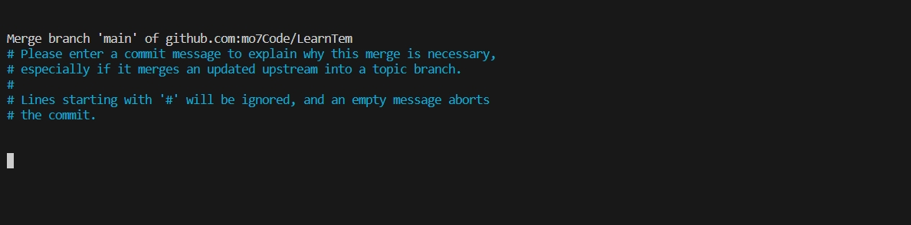

# 问题合集

## fetch first

1. 报错信息

```git
! [rejected]        main -> main (fetch first)
error: failed to push some refs to 'https://github.com/mo7Code/LearnTem/'
hint: Updates were rejected because the remote contains work that you do
hint: not have locally. This is usually caused by another repository pushing
hint: to the same ref. You may want to first integrate the remote changes
hint: (e.g., 'git pull ...') before pushing again.
hint: See the 'Note about fast-forwards' in 'git push --help' for details.
```

2. 发生原因：

本地仓库与远程仓库的内容不一致所导致，团队成员修改了远程仓库，自己本地仓库没有同步拉取过来，以至于在git push提交时，会检测到之前从远程仓库的拉取的和现在的不一样，进而报错。

3. 解决方案

将远程仓库修改的内容更新到本地仓库：`git pull --rebase origin main`

再次进行提交`git push origin main`

若远程仓库上已经更新的地方与当前提交的修改的地方一致，那么此时本地仓库上的修改可能会被覆盖。这样可以使用`git fetch origin main`(不会自动合并)，然后查看更新情况再进行有选择的合并。或者将本地仓库修改过的内容备份，`git pull origin main`后在重新修改

## git pull 相关错误

### 问题背景

git 版本为2.27.0 以上时，使用`git pull`会出现以下警告：

```git
hint: Pulling without specifying how to reconcile divergent branches is
hint: discouraged. You can squelch this message by running one of the following
hint: commands sometime before your next pull:
hint: 
hint:   git config pull.rebase false  # merge (the default strategy)
hint:   git config pull.rebase true   # rebase
hint:   git config pull.ff only       # fast-forward only
hint: 
hint: You can replace "git config" with "git config --global" to set a default
hint: preference for all repositories. You can also pass --rebase, --no-rebase,
hint: or --ff-only on the command line to override the configured default per
hint: invocation.
```

```git
提示：不鼓励在未说明如何调和不同分支的情况下进行拉动
提示：您可以通过运行以下命令之一来消除此消息
提示：在下次拉取之前的某个时间发出命令：
暗示：
提示： git config pull.rebase false # 合并（默认策略）
提示： git config pull.rebase true # rebase
提示： git config pull.ff only # 仅快进
提示：
提示：您可以将“git config”替换为“git config --global”以设置默认值
提示：所有存储库的首选项。 您还可以传递 --rebase, --no-rebase,
提示：或在命令行上使用 --ff-only 来覆盖配置的默认值
提示：调用。
```

### 解决办法

`git pull origin main`或者`git branch --set-upstream-to <branch-name> origin/<branch-name>`建立联系后，在`git pull`
此命令等同于

```git
git fetch origin <本地分支>
git diff  <本地分支>  #比较本地分支的不同
git merge <本地分支>   #合并本地分支
git branch -d <本地分支>  #删除本地分支
```

## 远程更新，本地也更新了

解决办法：

1. 输入`git status`查看本地修改
2. 输入`git stash` 隐藏本地修改
3. 输入`git pull`从远程拉取更新
4. 输入`git stash pop stash@{版本号}`
5. 然后再暂存，提交。

## 合并冲突问题

当出现以下图片中的问题时


- 按键盘上的“i”键可进入插入模式
- 这时可以修改最上方的黄色部分，改成你想写的合并原因
- 按键盘上的“Esc”键退出插入模式
- 最后在最下面输入“ :wq ”后按回车键即可

倘若以上操作不能解决问题的时候，可以尝试以下操作：

- git status 查询文件状态
- git log 查询提交历史
- git fetch origin  用于从远程仓库（origin）获取最新的更新
- git reset --hard origin/master 用于将当前分支重置为远程仓库（origin）的master分支的状态。这个命令会丢弃所有本地的修改和未提交的更改，并将当前分支重置为远程master分支的最新状态。请注意，这个操作是不可逆的，所以在执行之前请确保已经备份好重要的代码。
