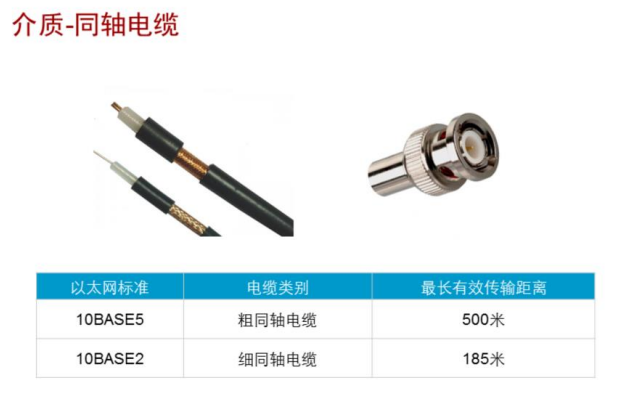
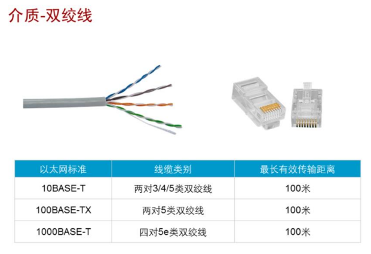
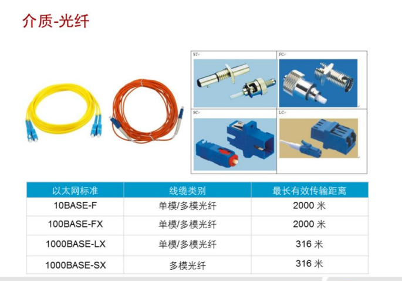
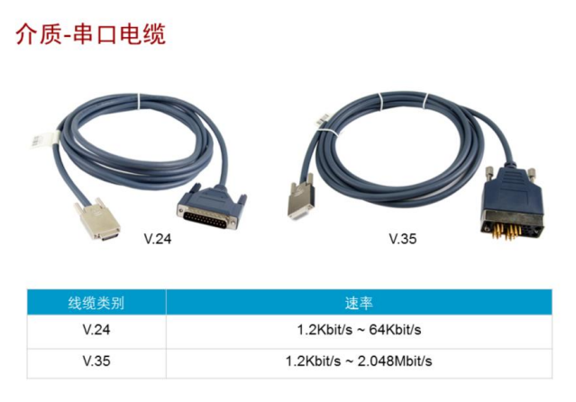
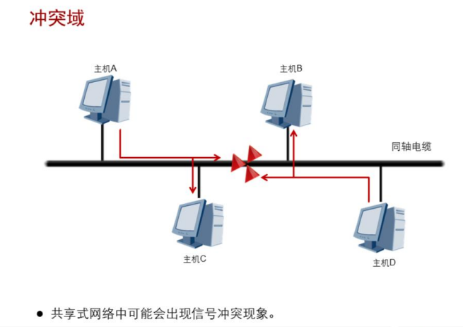

# 网络笔记

## HCNA-HNTD入门

###   企业网络基本架构

​      企业网络架构很大程度上取决于企业或机构的业务需求。小型企业通常 只有一个办公地点，一般采用扁平网络架构进行组网。这种扁平网络能 够满足用户对资源访问的需求，并具有较强的灵活性，同时又能大大减 少部署和维护成本。小型企业网络通常缺少冗余机制，可靠性不高，容 易发生业务中断。 大型企业网络对业务的连续性要求很高，所以通常会通过网络冗余备份 来保证网络的可用性和稳定性，从而保障企业的日常业务运营。

​     大型企业网络也会对业务资源的访问进行控制，所以通常会采用多层网络架构 来优化流量分布，并应用各种策略进行流量管理和资源访问控制。多层 网络设计也可以使网络易于扩展。大型企业网络采用模块化设计能够有 效实现网络隔离并简化网络维护，避免某一区域产生的故障影响到整个网络。

#### 组网差别？

​    小型企业网络通常采用扁平网络结构，网络扩展能力低。如需支持未来不断增长的用户，应采用多层网络结构。

​    大型企业网络用户较多，通常采用层次化结构以支持网络的扩展和用户的增长。  在设计大型企业网络时必须首先考虑企业业务的特点，在保证网络性能满足业务需求的前提下，必须还要考虑网络的可用性、稳定性、可扩展性、安全性和可管理性，以保证企业业务的正常运营和发展。

### 1、传输介质

​    终端可以产生、发送和接收数据，网络是终端建立通信的媒介，终端通 过网络建立连接。用来传输数据的载体称为介质，网络可以使用各种介 质进行数据传输，包括物理线缆，无线电波等

​    网络就是通过介质把终端互连而成的一个规模大、功能强的系统，从而 使得众多的终端可以方便地互相传递信息，共享信息资源。

#### **同轴电缆**

​     同轴电缆的标准分为两种， 10BASE2和10BASE5。这两种标准都支持10Mbps的传输速率，最长传输距离分别为185米和500米。一般情况下，10Base2同轴电缆使用 BNC接头，10Base5同轴电缆使用N型接头

​    10BASE5和10BASE2是早期的两种以太网标准，它们均采用同轴电缆作为传输介质。10BASE5和10BASE2所使用的同轴电缆的直径分别为 9.5mm和5mm，所以前者又称为粗缆，后者又称为细缆

​    10Mbps的传输速率早已不能满足目前企业网络需求，因此同轴电缆在目前企业网络中很少应用

#### **双绞线**

Twisted Pair

   

双绞线可分为屏蔽双绞线(Shielded Twisted Pair，STP)和非屏蔽双绞线(Unshielded Twisted Pair，UTP)。

   屏蔽双绞线在双绞线与外层绝缘封套之间有一个金属屏蔽层，可以屏蔽电磁干扰。双绞线有很多种类型，不同类型的双绞线所支持的传输速率 一般也不相同。

   例如，3类双绞线支持10Mbps传输速率；

​              5类双绞线支持100Mbps传输速率；

​              超5类双绞线及更高级别的双绞线支持千兆以太网传输。双绞线使用RJ-45接头连接网络设备。为保证终端能够正确收发数据，RJ-45接头中的针脚必须按照一定的线序排列。

#### 光纤

fiber

​      双绞线和同轴电缆传输数据时使用的是电信号，而光纤传输数据时使用 的是光信号。光纤支持的传输速率包括10Mbps，100Mbps，1Gbps， 10Gbps，甚至更高。根据光纤传输光信号模式的不同，光纤又可分为单模光纤和多模光纤。

​      单模光纤只能传输一种模式的光，不存在模间色散，因此适用于长距离高速传输。

​      多模光纤允许不同模式的光在一根光纤上传输，由于模间色散较大而导致信号脉冲展宽严重，因此多模光纤主要用于局域网中的短距离传输。光纤连接器种类很多，常用的连接器 包括ST，FC，SC，LC连接器。

​      

#### 串口电缆

​     网络通信中常常会用到各种各样的串口电缆。常用的串口电缆标准为 RS-232，同时也是推荐的标准。但是RS-232的传输速率有限，传输距离仅为6米。其他的串口电缆标准可以支持更长的传输距离，如RS-422和RS-485的传输距离可达1200米。

​     RS-422和RS-485串口电缆通常使用V.35接头，这种接头在上世纪80年代已经淘汰，但是现在仍在帧中继、ATM等传统网络上使用。

​     V.24是RS-232标准的欧洲版。RS-232本身没有定义接头标准，常用的接头类型为DB-9和DB-25。现在，RS-232已逐渐被FireWire、USB等新标准取代，新产品和新设备已普遍使 用USB标准。

#### 冲突域

    上图是一个10BASE5以太网，每个主机都是用同一根同轴电缆来与其它主机进行通信，因此，这里的同轴电缆又被称为共享介质，相应的网络被称为共享介质网络，或简称为共享式网络。

​     共享式网络中，不同的主机同时发送数据时，就会产生信号冲突的问题，解决这一问题的方法一 般是采用载波侦听多路访问/冲突检测技术（Carrier Sense Multiple Access/Collision Detection）。 

​      CSMA/CD的基本工作过程如下： 

1. 终端设备不停地检测共享线路的状态。如果线路空闲，则可以发送数据；如果线路不空闲，则等待一段时间后继续检测（延时时间由 退避算法决定）。 
2.  如果有另外一个设备同时发送数据，两个设备发送的数据会产生冲突
3.  终端设备检测到冲突之后，会马上停止发送自己的数据，并发送特殊阻塞信息，以强化冲突信号，使线路上其他站点能够尽早检测到冲突。 
4.  终端设备检测到冲突后，等待一段时间之后再进行数据发送（延时时间由退避算法决定）。CSMA/CD的工作原理可简单总结为：先听后发，边发边听，冲突停发，随机延迟后重发。

#### 双工模式

半双工：在半双工模式（half-duplex mode）下，通信双方都能发送和接收数据，但不能同时进行。当一台设备发送时，另一台只能接收，反之亦然。对讲机是半双工的典型例子。 

全双工：在全双工模式（full-duplex mode）下，通信双方都能同时接收和发送数据。电话网络是典型的全双工例子。 

以太网上的通信模式包括半双工和全双工两种： 

​    半双工模式下，共享物理介质的通信双方必须采用CSMA/CD机制来避免冲突。例如，10BASE5以太网的通信模式就必须是半双工模式

​    全双工模式下，通信双方可以同时实现双向通信，这种模式不会产生冲 突，因此不需要使用CSMA/CD机制。例如，10BASE-T以太网的通信模式就可以是全双工模式

同一物理链路上相连的两台设备的双工模式必须保持一致

#### 总结

部署千兆以太网使用哪种传输介质？

​    千兆以太网传输必须使用超5类标准及以上的双绞线 或使用千兆及更高等级的光纤

### 2、以太网帧结构

以太网是根据IEEE802.3 标准来管理和控制数据帧的

#### 网络通信协议

​     各大厂商和标准组织为了在数据通信网络领域占据主导地位，纷纷推出了各自的网络架构体系和标准，如IBM公司的SNA协议，Novell公司的IPX/SPX协议，以及广泛流行的OSI参考模型和TCP/IP协议。

​     各大厂商根据这些协议 生产出了不同的硬件和软件。标准组织和厂商的共同努力促进了网络技术的快速发展和网络设备种类的迅速增长

​     网络通信中，“协议”和“标准”这两个词汇常常可以混用。同时，协议或标准本身又常常具有层次的特点。一般地，关注于逻辑数据关系的协议通常被称为上层协议，而关注于物理数据流的协议通常被称为低层协议。

​      IEEE 802就是一套用来管理物理数据流在局域网中传输的标准， 包括在局域网中传输物理数据的802.3以太网标准，还有一些用来管理物理数据流在使用串行介质的广域网中传输的标准，

​      如帧中继FR （Frame Relay），高级数据链路控制HDLC（High-Level Data Link Control），异步传输模式ATM（Asynchronous Transfer Mode）

#### OSI参考模型

物数网传会表应

OSI参考模型具有以下优点：简化了相关的网络操作；提供了不同厂商之间的兼容性；促进了标准化工作；结构上进行了分层；易于学习和操作。 

OSI参考模型各个层次的基本功能如下：

 物理层：在设备之间传输比特流，规定了电平、速度和电缆针脚。 

 数据链路层：将比特组合成字节，再将字节组合成帧，使用链路层地址 （以太网使用MAC地址）来访问介质，并进行差错检测。 

 网络层：提供逻辑地址，供路由器确定路径。 

 传输层：提供面向连接或非面向连接的数据传递以及进行重传前的差错检测。 

  会话层：负责建立、管理和终止表示层实体之间的通信会话。该层的通信由不同设备中的应用程序之间的服务请求和响应组成。 

  表示层：提供各种用于应用层数据的编码和转换功能，确保一个系统的 应用层发送的数据能被另一个系统的应用层识别。 应用层：OSI参考模型中最靠近用户的一层，为应用程序提供网络服务。

  应用层：OSI参考模型中最靠近用户的一层，为应用程序提供网络服务

#### TCP/IP模型

  TCP/IP模型将网络分为四层。

  TCP/IP模型不关注底层物理介质，主要关注终端之间的逻辑数据流转发。     TCP/IP模型的核心是网络层和传输层， 网络层解决网络之间的逻辑转发问题，传输层保证源端到目的端之间的可靠传输。最上层的应用层通过各种协议向终端用户提供业务应用。

#### 数据封装

​    应用数据需要经过TCP/IP每一层处理之后才能通过网络传输到目的端， 每一层上都使用该层的协议数据单元PDU（Protocol Data Unit）彼此交换信息。不同层的PDU中包含有不同的信息，因此PDU在不同层被赋予了不同的名称。

​    如上层数据在传输层添加TCP报头后得到的PDU被称为 Segment（数据段）；数据段被传递给网络层，网络层添加IP报头得到 的PDU被称为Packet（数据包）；数据包被传递到数据链路层，封装数据链路层报头得到的PDU被称为Frame（数据帧）；最后，帧被转换为比特，通过网络介质传输。这种协议栈逐层向下传递数据，并添加报头和报尾的过程称为封装

#### 终端间通信

数据包在以太网物理介质上传播之前必须封装头部和尾部信息，封装后的数据包称为数据帧，数据帧中封装的信息决定了数据如何传输。

以太网上传输的数据帧有两种格式，选择哪种格式由TCP/IP协议簇中的网络 层决定

##### 帧格式

目的地mac地址  源mac地址   都是6字节

length/Type    2字节  前12位指定帧的长度  后4位指定帧的类型

FCS（校验和）：  4字节 ，用于检测帧传输过程中的错误

LLC（逻辑链路控制）：是数据链路层的第二层子层，位于mac子层之上，网络层之下。

SNAP（子网访问协议）：是LLC子层的一种协议，允许不同类型的网络协议共存于同一数据链路层。

第一种是上世纪80年代初提出的DIX v2 格式，即Ethernet II帧格式。Ethernet II后来被IEEE 802标准接纳，并写进了IEEE 802.3x-1997的3.2.6节。

第二种是1983年提出的IEEE 802.3 格式，这两种格式的主要区别在于Ethernet II格式中包含一个Type字段， 标识以太帧处理完成之后将被发送到哪个上层协议进行处理，IEEE 802.3格式中，同样的位置是长度字段

不同的Type字段值可以用来区别这两种帧的类型，

当Type字段值小于 等于1500（或者十六进制的0x05DC）时，帧使用的是IEEE 802.3格式。

 当Type字段值大于等于1536 （或者十六进制的0x0600）时，帧使用的是Ethernet II格式。以太网中大多数的数据帧使用的是Ethernet II格式。

**Ethernet_II帧格式**

1. DMAC（Destination MAC）是目的MAC地址。DMAC字段长度为6 个字节，标识帧的接收者。
2. SMAC（Source MAC）是源MAC地址。SMAC字段长度为6个字节， 标识帧的发送者。 
3. 类型字段（Type）用于标识数据字段中包含的高层协议，该字段长度为2个字节。类型字段取值为0x0800的帧代表IP协议帧；类型字段取值为0x0806的帧代表ARP协议帧。
4.  数据字段（Data）是网络层数据，最小长度必须为46字节以保证帧长至少为64字节，数据字段的最大长度为1500字节。 
5.  循环冗余校验字段（FCS）提供了一种错误检测机制。该字段长度为4个字节。

**IEEE802.3帧格式**

IEEE802.3帧格式类似于Ethernet_II帧，只是Ethernet_II帧的Type域被 802.3帧的Length域取代，并且占用了Data字段的8个字节作为LLC和 SNAP字段。 

 1. Length字段定义了Data字段包含的字节数

 2.逻辑链路控制LLC（Logical Link Control）由目的服务访问点DSAP （ Destination Service Access Point ） 、 源 服 务 访 问 点 SSAP （Source Service Access Point）和Control字段组成。

3.SNAP（Sub-network Access Protocol）由机构代码（Org Code） 和类型（Type）字段组成。Org Code三个字节都为0。Type字段的 含义与Ethernet_II帧中的Type字段相同。IEEE802.3帧根据DSAP和 SSAP字段的取值又可分为以下几类： 

   1）当DSAP和SSAP都取特定值0xff时，802.3帧就变Netware-ETHERNET帧，用来承载NetWare类型的数据。 

  2 ） 当 DSAP 和 SSAP 都 取 特 定 值 0xaa 时 ， 802.3 帧 就 变 成 了 ETHERNET_SNAP帧。ETHERNET_SNAP帧可以用于传输多种协议。

  3）DSAP和SSAP其他的取值均为纯IEEE802.3帧

#### 数据帧传输

以太网在二层链路上通过MAC地址来唯一标识网络设备，并且实现局域网上网络设备之间的通信。

MAC地址也叫物理地址，大多数网卡厂商把 MAC地址烧入了网卡的ROM中。发送端使用接收端的MAC地址作为目的地址。以太帧封装完成后会通过物理层转换成比特流在物理介质上传输。

#####  MAC地址

   每一台网络设备都用物理地址来标识自己，这个地址就是MAC地址。网络设备的MAC地址是全球唯一的。 

​    MAC地址长度为48比特，通常用十六进制表示。

​    MAC地址包含两部分： 前 24 比 特 是 组 织 唯 一 标 识 符 （ OUI ， Organizationally Unique Identifier），由IEEE统一分配给设备制造商。例如，华为的网络产品的 MAC地址前24比特是0x00e0fc。

​    后24位序列号是厂商分配给每个产品的唯一数值，由各个厂商自行分配（这里所说的产品可以是网卡或者其他需要MAC地址的设备）

#### 帧发送方式

##### 单播

从单一的源端发送到单一的目的端。

每个主机接口由一个MAC地址唯一标识，MAC 地址的OUI中，第一字节第8个比特表示地址类型。

对于主机MAC地址， 这个比特固定为0，表示目的MAC地址为此MAC地址的帧都是发送到某个唯一的目的端。

在冲突域中，所有主机都能收到源主机发送的单播帧， 但是其他主机发现目的地址与本地MAC地址不一致后会丢弃收到的帧， 只有真正的目的主机才会接收并处理收到的帧

##### 广播

表示帧从单一的源发送到共享以太网上的所有主机

广播帧的目的MAC地址为十六进制的FF:FF:FF:FF:FF:FF，所有收到该广播帧的主机都要接收并处理这个帧。 广播方式会产生大量流量，导致带宽利用率降低，进而影响整个网络的性能。 

当需要网络中的所有主机都能接收到相同的信息并进行处理的情况下， 通常会使用广播方式。

##### 组播

组播比广播更加高效。

组播转发可以理解为选择性的广播，主机侦听特定组播地址，接收并处理目的MAC地址为该组播MAC地址的帧。 

组播MAC地址和单播MAC地址是通过第一字节中的第8个比特区分的。

  组播MAC地址的第8个比特为1，而单播MAC地址的第8个比特为0。 当需要网络上的一组主机（而不是全部主机）接收相同信息，并且其他主机不受影响的情况下通常会使用组播方式。

##### 数据帧的发送和接收

​     帧从主机的物理接口发送出来后，通过传输介质传输到目的端。共享网络中，这个帧可能到达多个主机。主机检查帧头中的目的MAC地址，如果目的MAC地址不是本机MAC地址，也不是本机侦听的组播或广播 MAC地址，则主机会丢弃收到的帧。 

​      如果目的MAC地址是本机MAC地址，则接收该帧，检查帧校验序列 （FCS）字段，并与本机计算的值对比来确定帧在传输过程中是否保持 了完整性。如果帧的FCS值与本机计算的值不同，主机会认为帧已被破坏，并会丢弃该帧。

​      如果该帧通过了FCS校验，则主机会根据帧头部中的Type字段来确定将帧发送给上层哪个协议处理。本例中，Type字段的值为0x0800，表明该帧需要发送到IP协议上处理。在发送给IP协议之 前，帧的头部和尾部会被剥掉。

#### 总结

1、网络设备如何确定以太网数据帧的上层协议？

​     以太网帧中包含一个Type字段，表示帧中的数据应该发送到上层哪 个协议处理。比如，IP协议对应的Type值为0x0800，ARP协议对应 的Type值为0x0806。

